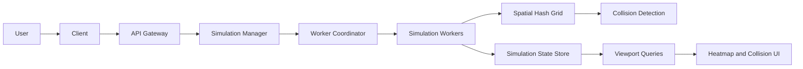

# Drone Collision Simulator

A high-throughput simulation for modeling up to 100,000 autonomous drones moving through a bounded three-dimensional world. The simulator is designed to make collisions uncommon during normal operation while still producing controlled collision scenarios for analysis.

The project combines simulation, spatial indexing, collision detection, AI-based movement, performance benchmarking, and viewport-based visualization. Development begins with a correct and measurable local simulation kernel before adding the UI or distributed processing.

## Project status

**Current phase:** architecture complete enough to begin Phase 1 implementation.

The first milestone is a single-process Python simulation kernel. Distributed workers, Redis, real-time streaming, and the heatmap interface are later phases and should not be included in the first implementation.

## Goals

- Simulate drone motion on a bounded XYZ coordinate grid.
- Scale toward 100,000 active drones.
- Avoid all-pairs collision checking through spatial hashing.
- Support deterministic and reproducible simulations.
- Detect collisions and near misses precisely.
- Keep ordinary collisions rare while guaranteeing controlled collision scenarios.
- Measure tick latency, throughput, candidate pairs, and collision frequency.
- Render density and collision data only for the user's visible viewport.
- Support partitioned and distributed execution after the local kernel is validated.

## Non-goals for Phase 1

- Distributed workers or volunteer compute clients
- Redis, databases, or message queues
- REST, WebSocket, or SSE APIs
- React or heatmap rendering
- GPU acceleration
- Neural-network inference or external AI APIs
- Terrain, buildings, globe projection, or weather simulation

## High-level architecture



The diagram represents the target architecture. Phase 1 runs the simulation engine, spatial hash, and collision pipeline locally in one process.

## Phase 1 simulation flow

Every fixed simulation tick follows the same ordered pipeline:

```text
SimulationEngine
  -> MovementSystem
  -> BoundaryManager
  -> SpatialHashGrid
  -> CollisionDetectionEngine
  -> CollisionResolutionEngine
  -> MetricsCollector
```

1. The movement system computes new velocities and positions.
2. The boundary manager constrains drones to the XYZ world.
3. The spatial hash assigns drones to grid cells.
4. Collision detection checks drones in the same and neighboring cells.
5. Collision resolution updates affected drone state.
6. Metrics are recorded for correctness and performance analysis.

## Data-oriented drone state

`Drone` is a logical domain entity in the system design. The performance-critical implementation must not create 100,000 heavyweight Python objects. Drone state will be stored in structure-of-arrays form using NumPy.

```python
positions: np.ndarray            # (N, 3), float32
velocities: np.ndarray           # (N, 3), float32
active_mask: np.ndarray          # (N,), bool
movement_policy_ids: np.ndarray  # (N,), integer
```

Initial simulation state includes:

| Concept | Initial state |
| --- | --- |
| Simulation | ID, status, tick, fixed time step, random seed |
| World | XYZ bounds, collision radius, near-miss radius |
| Drone state | Positions, velocities, active mask, policy IDs |
| Spatial hash | Cell size and mapping from cell coordinates to drone indices |
| Collision event | Tick, drone IDs, position, distance, relative speed |
| Near-miss event | Tick, drone IDs, minimum distance |
| Metrics | Tick time, candidate pairs, collisions, near misses |

## Spatial hashing

A brute-force collision detector compares every pair of drones and has quadratic complexity. At 100,000 drones, that would require checking approximately five billion pairs per tick.

The spatial hash divides the world into uniform XYZ cells. Each drone is compared only with drones in its own cell and the 26 adjacent 3D cells. The cell size must be at least the configured interaction radius so that relevant pairs are not missed.

The optimized detector will be verified against a brute-force reference implementation on small deterministic simulations.

## Movement and AI

Movement algorithms are interchangeable policies applied in batches. Planned policies include:

- Random movement for baseline simulation
- Scripted routes for deterministic scenarios
- AI movement for local avoidance and trajectory selection

The AI movement layer should use local numerical inference or decision algorithms rather than one external model request per drone. Movement policies must operate on batches of drone state to remain practical at 100,000 drones.

Rare collisions will be produced by a scenario controller that occasionally creates converging routes or alters avoidance behavior for selected drones. It influences movement generation; it does not change collision-detection rules.

## Collision processing

The collision pipeline separates detection from resolution:

- `CollisionDetectionEngine` finds candidate pairs and creates collision or near-miss events.
- `CollisionResolutionEngine` consumes collision events and updates affected state.
- The simulation worker later writes event batches and publishes real-time updates.

Candidate pairs must be unique, and each unordered pair may appear at most once per tick.

## Phase 1 acceptance criteria

Phase 1 is complete when the local kernel can:

- Generate reproducible XYZ positions and velocities from a random seed.
- Move drones using a fixed time step.
- Enforce configurable world boundaries.
- Insert and update drones in a uniform spatial hash.
- Detect unique collisions and near misses.
- Match brute-force collision results on small test cases.
- Run benchmarks with 1,000, 10,000, and 100,000 drones.
- Report tick latency, ticks per second, candidate pairs, collisions, and near misses.
- Run without Redis, a database, a web server, or a frontend.

Reaching 100,000 drones is a benchmark target, not permission to sacrifice correctness. Performance optimization begins only after the spatial detector matches the reference detector.

## Planned project structure

```text
drone-collision-simulator/
├── README.md
├── pyproject.toml
├── src/
│   └── drone_sim/
│       ├── config.py
│       ├── state.py
│       ├── simulation.py
│       ├── movement.py
│       ├── boundaries.py
│       ├── spatial_hash.py
│       ├── collisions.py
│       └── metrics.py
├── tests/
│   ├── test_movement.py
│   ├── test_boundaries.py
│   ├── test_spatial_hash.py
│   └── test_collisions.py
└── benchmarks/
    └── benchmark_simulation.py
```

This structure is provisional. It should remain small until the local simulation kernel is working and benchmarked.

## Roadmap

### Phase 1: Local simulation kernel

- Vectorized XYZ drone state
- Fixed-timestep movement
- Boundary handling
- Spatial hashing
- Collision and near-miss detection
- Correctness tests and benchmarks

### Phase 2: AI and scenario control

- Batched movement policies
- Local collision avoidance
- Trajectory prediction
- Controlled rare-collision scenarios
- Collision-rate validation

### Phase 3: Visualization and APIs

- Simulation control API
- Viewport queries by bounding box and altitude range
- Density heatmap tiles
- Precise collision markers and details
- Real-time state and metrics updates

### Phase 4: Distributed execution

- Worker coordinator and worker pool
- Spatial partitions
- Boundary-drone exchange
- Partition rebalancing
- Worker failure recovery

### Phase 5: Optimization and deployment

- Profiling and hot-path optimization
- Optional native or GPU acceleration
- Redis or another event transport if measurements justify it
- Monitoring, checkpointing, and deployment

## Engineering principles

- Correctness before optimization
- Measurements before infrastructure
- Batch operations instead of per-drone Python loops
- Deterministic tests before randomized stress tests
- One local worker before distributed workers
- Explicit interfaces between movement, indexing, detection, and rendering
- Architectural diagrams guide the design but are not a literal requirement to implement every class immediately

## Intended technology stack

| Layer | Initial choice |
| --- | --- |
| Simulation | Python 3.11+ and NumPy |
| Testing | pytest |
| Benchmarking | Python timing and profiling tools |
| Backend, later | FastAPI |
| Streaming, later | WebSocket or SSE |
| Frontend, later | React with Canvas or WebGL rendering |
| Messaging, later | Redis only if distributed measurements justify it |

## License

No license has been selected yet.