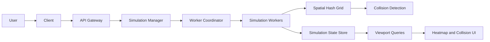

# Drone Collision Simulator

A high-throughput simulation for modeling up to 100,000 autonomous drones moving through a bounded three-dimensional world. The simulator is designed to make collisions uncommon during normal operation while still producing controlled collision scenarios for analysis.

The project combines simulation, spatial indexing, collision detection, AI-based movement, performance benchmarking, and viewport-based visualization. Development begins with a correct and measurable local simulation kernel before adding the UI or distributed processing.

## Project status

**Current phase:** Phase 1 (local simulation kernel) and Phase 2 (AI and scenario control — batched movement policies, trajectory prediction, local collision avoidance, controlled rare-collision scenarios, collision-rate validation) are implemented, tested, and benchmarked. A local Matplotlib debug viewer has also been added (see below). Online reinforcement learning, `NeuralAvoidanceMovementAlgorithm`, distributed workers, Redis, real-time streaming, and the production heatmap dashboard are later phases and are not part of this implementation.

## Getting started

Run every command from the repository root (the folder containing `pyproject.toml`).

**1. Install dependencies**

```bash
pip install -r requirements.txt
# or, without the visualization dependency:
pip install -e .
```

**2. Run the test suite**

```bash
python -m pytest -q
```

This picks up `src/` and `tests/` automatically via `pyproject.toml`'s `pythonpath`/`testpaths` settings — no manual `PYTHONPATH` needed. 128 tests as of Phase 2 (kernel, movement/trajectory/scenario/validation — including the collision-pair-tick and unique-collision-event metrics — and visualization-calculation tests).

**3. Run the benchmark**

```bash
python benchmarks/benchmark_simulation.py
# or customize:
python benchmarks/benchmark_simulation.py --ticks 20 --sizes 1000 10000
```

Runs the kernel headlessly at 1,000 / 10,000 / 100,000 drones and reports tick latency, throughput, candidate pairs, collisions, and near misses.

**4. Run the local debug viewer**

```bash
python scripts/run_visualizer.py --drones 10000 --render-every 5
```

See [Local debug viewer](#local-debug-viewer-prototype) below for details and keyboard controls.

## Goals

- Simulate drone motion on a bounded XYZ coordinate grid.
- Scale toward 100,000 active drones.
- Avoid all-pairs collision checking through spatial hashing.
- Support deterministic and reproducible simulations.
- Detect collisions and near misses precisely.
- Keep ordinary collisions rare while guaranteeing controlled collision scenarios.
- Measure tick latency, throughput, candidate pairs, and collision frequency.
- Render density and collision data only for the user's visible viewport.
- Support partitioned and distributed execution after the local kernel is validated.

## Non-goals for Phase 1

- Distributed workers or volunteer compute clients
- Redis, databases, or message queues
- REST, WebSocket, or SSE APIs
- React or heatmap rendering
- GPU acceleration
- Neural-network inference or external AI APIs
- Terrain, buildings, globe projection, or weather simulation

## High-level architecture



The diagram represents the target architecture. Phase 1 runs the simulation engine, spatial hash, and collision pipeline locally in one process.

## Phase 1 simulation flow

Every fixed simulation tick follows the same ordered pipeline:

```text
SimulationEngine
  -> MovementSystem
  -> BoundaryManager
  -> SpatialHashGrid
  -> CollisionDetectionEngine
  -> CollisionResolutionEngine
  -> MetricsCollector
```

1. The movement system computes new velocities and positions.
2. The boundary manager constrains drones to the XYZ world.
3. The spatial hash assigns drones to grid cells.
4. Collision detection checks drones in the same and neighboring cells.
5. Collision resolution updates affected drone state.
6. Metrics are recorded for correctness and performance analysis.

## Data-oriented drone state

`Drone` is a logical domain entity in the system design. The performance-critical implementation must not create 100,000 heavyweight Python objects. Drone state will be stored in structure-of-arrays form using NumPy.

```python
positions: np.ndarray            # (N, 3), float32
velocities: np.ndarray           # (N, 3), float32
active_mask: np.ndarray          # (N,), bool
movement_policy_ids: np.ndarray  # (N,), integer
```

Initial simulation state includes:

| Concept | Initial state |
| --- | --- |
| Simulation | ID, status, tick, fixed time step, random seed |
| World | XYZ bounds, collision radius, near-miss radius |
| Drone state | Positions, velocities, active mask, policy IDs |
| Spatial hash | Cell size and mapping from cell coordinates to drone indices |
| Collision event | Tick, drone IDs, position, distance, relative speed |
| Near-miss event | Tick, drone IDs, minimum distance |
| Metrics | Tick time, candidate pairs, collisions, near misses |

## Spatial hashing

A brute-force collision detector compares every pair of drones and has quadratic complexity. At 100,000 drones, that would require checking approximately five billion pairs per tick.

The spatial hash divides the world into uniform XYZ cells. Each drone is compared only with drones in its own cell and the 26 adjacent 3D cells. The cell size must be at least the configured interaction radius so that relevant pairs are not missed.

The optimized detector will be verified against a brute-force reference implementation on small deterministic simulations.

## Movement and AI

Movement algorithms are interchangeable policies applied in batches:

- `RandomMovementAlgorithm` — reproducible random walk (Phase 1 baseline).
- `ScriptedMovementAlgorithm` — constant velocity (Phase 1, deterministic).
- `GoalDirectedMovementAlgorithm` — steers toward a fixed destination with
  acceleration/speed limits and no avoidance (Phase 2). Serves as the
  no-avoidance comparison baseline for local avoidance.
- `LocalAvoidanceMovementAlgorithm` — goal-directed movement plus a bounded
  correction away from the single most urgent predicted threat (Phase 2).
- `NeuralAvoidanceMovementAlgorithm` — **planned, not implemented.** See
  [Phase 2: AI and scenario control](#phase-2-ai-and-scenario-control) below
  for why it comes after deterministic avoidance is proven correct.

All policies operate on batches of drone state (never a per-drone Python
loop) to remain practical at 100,000 drones.

Rare collisions are produced by a deterministic, seeded scenario factory
(`src/drone_sim/scenarios.py`) that injects a small, known number of
collision courses and near misses among many safe background drones. It only
influences movement generation and starting conditions; it never changes
collision-detection rules.

## Collision processing

The collision pipeline separates detection from resolution:

- `CollisionDetectionEngine` finds candidate pairs and creates collision or near-miss events.
- `CollisionResolutionEngine` consumes collision events and updates affected state.
- The simulation worker later writes event batches and publishes real-time updates.

Candidate pairs must be unique, and each unordered pair may appear at most once per tick.

## Phase 1 acceptance criteria

Phase 1 is complete when the local kernel can:

- Generate reproducible XYZ positions and velocities from a random seed.
- Move drones using a fixed time step.
- Enforce configurable world boundaries.
- Insert and update drones in a uniform spatial hash.
- Detect unique collisions and near misses.
- Match brute-force collision results on small test cases.
- Run benchmarks with 1,000, 10,000, and 100,000 drones.
- Report tick latency, ticks per second, candidate pairs, collisions, and near misses.
- Run without Redis, a database, a web server, or a frontend.

Reaching 100,000 drones is a benchmark target, not permission to sacrifice correctness. Performance optimization begins only after the spatial detector matches the reference detector.

## Project structure

```text
drone-collision-simulator/
├── README.md
├── requirements.txt
├── pyproject.toml
├── src/
│   └── drone_sim/
│       ├── config.py
│       ├── state.py
│       ├── simulation.py
│       ├── movement.py
│       ├── trajectory.py
│       ├── scenarios.py
│       ├── validation.py
│       ├── boundaries.py
│       ├── spatial_hash.py
│       ├── collisions.py
│       ├── metrics.py
│       └── visualization.py
├── tests/
│   ├── test_movement.py
│   ├── test_trajectory.py
│   ├── test_scenarios.py
│   ├── test_validation.py
│   ├── test_boundaries.py
│   ├── test_spatial_hash.py
│   ├── test_collisions.py
│   └── test_visualization.py
├── benchmarks/
│   └── benchmark_simulation.py
└── scripts/
    └── run_visualizer.py
```

## Roadmap

### Phase 1: Local simulation kernel

- Vectorized XYZ drone state
- Fixed-timestep movement
- Boundary handling
- Spatial hashing
- Collision and near-miss detection
- Correctness tests and benchmarks

### Phase 2: AI and scenario control (complete)

- Batched movement policies (`GoalDirectedMovementAlgorithm`, `LocalAvoidanceMovementAlgorithm`)
- Trajectory prediction (`TrajectoryPredictionService`)
- Local collision avoidance
- Controlled rare-collision scenarios (`src/drone_sim/scenarios.py`)
- Collision-rate validation (`src/drone_sim/validation.py`)
- Online reinforcement learning and `NeuralAvoidanceMovementAlgorithm` are
  explicitly deferred — see [Phase 2](#phase-2-ai-and-scenario-control) below.

### Phase 3: Visualization and APIs

- Simulation control API
- Viewport queries by bounding box and altitude range
- Density heatmap tiles
- Precise collision markers and details
- Real-time state and metrics updates

### Phase 4: Distributed execution

- Worker coordinator and worker pool
- Spatial partitions
- Boundary-drone exchange
- Partition rebalancing
- Worker failure recovery

### Phase 5: Optimization and deployment

- Profiling and hot-path optimization
- Optional native or GPU acceleration
- Redis or another event transport if measurements justify it
- Monitoring, checkpointing, and deployment

## Engineering principles

- Correctness before optimization
- Measurements before infrastructure
- Batch operations instead of per-drone Python loops
- Deterministic tests before randomized stress tests
- One local worker before distributed workers
- Explicit interfaces between movement, indexing, detection, and rendering
- Architectural diagrams guide the design but are not a literal requirement to implement every class immediately

## Intended technology stack

| Layer | Initial choice |
| --- | --- |
| Simulation | Python 3.11+ and NumPy |
| Testing | pytest |
| Benchmarking | Python timing and profiling tools |
| Backend, later | FastAPI |
| Streaming, later | WebSocket or SSE |
| Frontend, later | React with Canvas or WebGL rendering |
| Messaging, later | Redis only if distributed measurements justify it |

## Phase 2: AI and scenario control

Phase 2 adds goal-seeking and local collision avoidance on top of the
unchanged Phase 1 kernel, plus the deterministic scenarios and validation
harness needed to prove avoidance actually helps before any neural policy is
considered.

### Corrected architecture (authoritative)

```
World "1" *-- "1" DroneState                          : owns
MovementSystem "1" --> "1" DroneState                  : reads and batch-updates
MovementSystem "1" o-- "1..*" MovementAlgorithm        : registers and dispatches
MovementAlgorithm <|-- RandomMovementAlgorithm
MovementAlgorithm <|-- ScriptedMovementAlgorithm
MovementAlgorithm <|-- GoalDirectedMovementAlgorithm
MovementAlgorithm <|-- LocalAvoidanceMovementAlgorithm
MovementAlgorithm <|.. NeuralAvoidanceMovementAlgorithm  : planned, not implemented
```

- `DroneState` never invokes or references a `MovementAlgorithm` — it is
  passive NumPy state (`positions`, `velocities`, `active_mask`,
  `movement_policy_ids`, and now an optional `goal_positions`). Policy
  *objects* live only in `MovementSystem.policies`; `DroneState` only ever
  holds the integer `movement_policy_ids`.
- `MovementSystem` reads those ids, groups active drones into one batch per
  distinct id, and dispatches each batch to its policy once. An unknown
  policy id present on an active drone raises immediately instead of being
  silently skipped.
- `SpatialHashGrid`, `BoundaryManager`, and `CollisionDetectionEngine` are
  unchanged from Phase 1 and contain no movement, avoidance, or neural logic.
- Destinations (`goal_positions`) are assigned during **scenario generation**
  (`src/drone_sim/scenarios.py`), never inside `MovementSystem.step()`.

### Phase 2 tick flow

Ticks are only more expensive than Phase 1 when at least one *registered*
policy sets `MovementAlgorithm.requires_context = True` (currently only
`LocalAvoidanceMovementAlgorithm`). `SimulationEngine` checks this once at
construction time; if no such policy is registered, the tick is byte-for-byte
the Phase 1 flow — no extra grid build, no prediction, no context.

```
 1. Read current active DroneState.
 2. Build SpatialHashGrid from PRE-MOVEMENT positions.
 3. Generate unique candidate pairs.
 4. TrajectoryPredictionService predicts time-to-closest-approach and
    predicted separation for each pair.
 5. NeighborFeatureBuilder builds a MovementContext (one row per drone: its
    single most urgent candidate pair, plus goal_vectors).
 6. MovementSystem groups drones by movement_policy_ids.
 7. Each policy is dispatched once for its complete batch (context passed
    through; Random/Scripted ignore it).
 8. Positions are integrated for all active drones.
 9. BoundaryManager applies world constraints.
10. SpatialHashGrid is REBUILT from POST-MOVEMENT positions.
11. CollisionDetectionEngine detects actual collisions/near misses from that
    rebuilt grid — the pre-movement grid/pairs from step 2 are never reused
    here.
12. CollisionResolutionEngine resolves; MetricsCollector records.
```

The pre-movement prediction only ever estimates *risk*; it is never the
authority for whether a collision actually happened. That distinction is
deliberate and load-bearing: `TrajectoryPredictionService` and
`CollisionDetectionEngine` never call each other.

### Trajectory-prediction mathematics

For each candidate pair `(i, j)`, assuming both keep their current velocity:

```
relative_position = position_j - position_i
relative_velocity = velocity_j - velocity_i

time_to_closest_approach = clip(
    -dot(relative_position, relative_velocity)
    / dot(relative_velocity, relative_velocity),
    0, prediction_horizon,
)   # guarded to 0 when relative speed is ~0, never divides by zero

predicted_separation = norm(
    relative_position + relative_velocity * time_to_closest_approach
)
```

Each pair is then classified, in priority order:

1. `PREDICTED_COLLISION` — `predicted_separation <= collision_radius`
2. `PREDICTED_NEAR_MISS` — `collision_radius < predicted_separation <= near_miss_radius`
3. `NOT_CLOSING_OR_OUTSIDE_HORIZON` — pair is diverging, or the true
   (unclipped) closest-approach time is beyond `prediction_horizon`
4. `CURRENTLY_SAFE` — everything else

Distance thresholds are checked before the not-closing/horizon flag, so a
pair already inside a risk band is never miscategorized just because it
happens to be (barely) diverging at this instant.

`LocalAvoidanceMovementAlgorithm` turns this into an urgency score gated on
distance (`dist_urgency`, provably `0` whenever the pair isn't
`PREDICTED_COLLISION`/`PREDICTED_NEAR_MISS`) and modulated — never
independently triggered — by time-to-closest-approach, so a pair correctly
classified as safe or diverging can never generate a correction purely
because its (irrelevant, clamped) time-to-closest-approach looks small.

### Controlled scenarios (`src/drone_sim/scenarios.py`)

Seven deterministic, seeded scenario factories, each returning a
`ScenarioResult` (a real `World` plus precomputed ground truth):

| Scenario | Purpose |
| --- | --- |
| `head_on_collision` | Two drones on a guaranteed head-on collision course |
| `crossing_paths` | Perpendicular paths meeting at the same point and tick |
| `near_miss` | Closest approach lands just outside `collision_radius`, inside the near-miss band |
| `parallel_safe` | Constant-separation control — must never register a collision or near miss |
| `stationary_obstacle` | One stationary drone; another flies directly into it |
| `converging_group` | Several drones converging on the world center from a ring |
| `rare_collision_background` | Many safe background drones + a small, known number of injected collision courses and near misses, with reflective goals so it can also drive policy comparison |

Timed scenarios use `dt`-aware geometry (a fixed tick count to closest
approach, scaled by `config.dt`) so the precomputed ground truth always lands
exactly on a simulated tick regardless of the configured time step.

### Collision-event deduplication and the two collision measurements

The simulator reports two distinct, complementary collision measurements,
both computed by `CollisionEventAccumulator` in `validation.py` from the
canonical (`i = min(a, b)`, `j = max(a, b)`) set of currently-colliding pairs
each tick:

- **Collision-pair tick** — one unordered drone pair observed inside
  `collision_radius` during one simulation tick. Every tick a pair is
  colliding, it adds 1 to `collision_pair_ticks`, whether or not that's the
  first tick of the contact. This measures **total time spent colliding**,
  including persistent collisions:
  `collision_pair_ticks += number_of_current_collision_pairs` each tick.
- **Unique collision event** — begins the tick an unordered pair transitions
  from not-colliding to colliding (`current_pairs - previous_tick_pairs`). A
  continuously overlapping pair is **not** re-counted as a new event every
  tick it persists; if it separates for at least one tick and later collides
  again, that is a second event. A collision already present on the first
  measured tick counts as one event. Near misses never enter either
  collision metric — they are tracked in a separate accumulator instance.

Derived from the two:

```
average_collision_pairs_per_tick = collision_pair_ticks / measured_tick_count
average_collision_duration_ticks = collision_pair_ticks / unique_collision_events
```

`average_collision_duration_ticks` is the average number of collision-pair-tick
readings belonging to each separate collision event (how long, on average, a
collision lasted). It is `0.0` — never `NaN` or an error — when
`unique_collision_events` is zero.

Worked example (used verbatim as a unit test): a pair colliding on ticks
2, 3, 4 and 6 of a 6-tick run (safe on ticks 1 and 5) gives
`collision_pair_ticks = 4`, `unique_collision_events = 2`,
`average_collision_pairs_per_tick = 4/6`, `average_collision_duration_ticks = 2.0`.

`CollisionEventAccumulator.previous_pairs` starts empty on every new instance
— state never leaks between policy runs or seeds; `CollisionRateValidator.run_policy`
creates a fresh accumulator (one for collisions, one for near misses) on
every call.

### Validation metrics (`src/drone_sim/validation.py`)

`CollisionRateValidator.compare(...)` runs the same scenario world (deep-
copied per policy, so runs never share mutable state) under
`ScriptedMovementAlgorithm` / `GoalDirectedMovementAlgorithm` /
`LocalAvoidanceMovementAlgorithm` and reports, per policy: unique collision
events, collision-pair ticks, average collision pairs per tick, average
collision duration (ticks), collisions per 10,000 drone-seconds, unique
near-miss events, near misses per 10,000 drone-seconds, avoidance success
rate (fraction of the scenario's known injected collision-course pairs that
never actually collided), minimum observed separation, destination
completion rate, average travel time, average drone speed, and
stationary-drone percentage. `compare_seed_suite(...)` repeats this across a
deterministic seed list and aggregates (means) per policy — no individual
seeded run is required to improve, only the aggregate.

Interpreting the two collision metrics together:
- Both decrease → avoidance reduces collision incidence **and** total
  collision exposure.
- Unique events decrease but collision-pair ticks do not → avoidance
  prevents some collisions, but the remaining ones persist longer.
- Neither decreases → the policy has not demonstrated collision reduction.

**The fair "does avoidance help" comparison is `goal_directed_no_avoidance`
vs. `local_avoidance`** — both actively seek the same goals, so both produce
the same busy, converging background traffic pattern; `scripted_baseline`
never seeks goals at all, so it naturally sees far less incidental traffic
and is not an apples-to-apples comparison for the *aggregate* rate (it
remains the correct ground-truth check for the specific injected pairs).

### Why neural training comes after deterministic validation

`NeuralAvoidanceMovementAlgorithm` is **planned future work, not
implemented**. Training or evaluating a learned avoidance policy requires a
trustworthy way to measure whether it actually reduces collision risk without
just stopping drones or abandoning their goals — that measurement tool
(`CollisionRateValidator`, exercised against known deterministic scenarios)
is exactly what this phase built. Deterministic avoidance and its validation
harness are the prerequisite, not a placeholder to route around.

## Local debug viewer (prototype)

A minimal Matplotlib-based viewer lets you watch the Phase 1 kernel run from a
top-down (x/y) perspective while you develop or debug it. It is a **prototype
for local debugging only** — not the Phase 3 production dashboard, and it adds
no React, FastAPI, REST, WebSocket/SSE, Redis, or GPU code. It reuses the
existing `Simulation`, `DroneState`, and `DetectionResult` APIs unchanged; the
headless benchmark remains fully independent of it.

It renders a density heatmap of drone positions (via `numpy.histogram2d`,
vectorized, no per-drone Python loop) plus red markers at the midpoint of each
collision detected in the most recently rendered interval.

Install the extra dependency (already listed in `requirements.txt` and the
`viz` optional dependency group in `pyproject.toml`):

```bash
pip install matplotlib
# or
pip install -r requirements.txt
```

Launch it from the repo root:

```bash
python scripts/run_visualizer.py --drones 10000 --render-every 5
```

Useful flags: `--drones`, `--seed`, `--render-every` (simulation ticks per
redraw), `--bins` (density grid resolution per axis).

Keyboard controls (shown at the bottom of the window):

| Key | Action |
| --- | --- |
| Space | Pause / resume |
| R | Reset the simulation (same config and seed) |
| Escape / close window | Quit |

The metrics panel distinguishes current-interval values (since the last
redraw) from cumulative values (since the simulation started or was last
reset).

## License

No license has been selected yet.