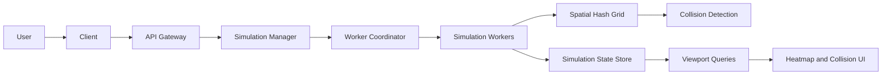

# Drone Collision Simulator

A high-throughput simulation for modeling up to 100,000 autonomous drones moving through a bounded three-dimensional world. The simulator is designed to make collisions uncommon during normal operation while still producing controlled collision scenarios for analysis.

The project combines simulation, spatial indexing, collision detection, AI-based movement, performance benchmarking, and viewport-based visualization. Development begins with a correct and measurable local simulation kernel before adding the UI or distributed processing.

## Project status

**Current phase:** Phase 3B — Real-time streaming and a bounded React dashboard

- Phase 1: Local simulation kernel — complete
- Phase 2: Deterministic movement intelligence and scenario control — complete
- Phase 3A: Snapshot, viewport-query API, and minimal browser visualization — complete
- Phase 3B: SSE streaming endpoint + React/Canvas dashboard (first bounded version) — complete

Phase 1 (local simulation kernel) and Phase 2 (AI and scenario control — batched movement policies, trajectory prediction, local collision avoidance, controlled rare-collision scenarios, collision-rate validation) are implemented, tested, and unchanged by Phase 3A/3B. Phase 3A (snapshot layer, background simulation runtime, vectorized viewport/heatmap/collision-marker queries, a small FastAPI app, and a minimal static browser page) remains as documented below. Phase 3B adds a `GET /simulations/{id}/stream` Server-Sent-Events endpoint and a small React + Canvas dashboard on top of Phase 3A's existing query logic — see [Phase 3B: real-time streaming and dashboard](#phase-3b-real-time-streaming-and-dashboard) below. Online reinforcement learning, `NeuralAvoidanceMovementAlgorithm` (evaluated and removed — see below), distributed workers, Redis, databases, authentication, cloud deployment, GPU simulation, and WebGL rendering remain out of scope.

Five separate benchmarks measure five different workloads — do not read one's numbers as covering another:

- `benchmarks/benchmark_simulation.py` measures the **Phase 1 tick path** (Random/Scripted policies, no `requires_context` policy registered — no pre-movement grid, prediction, or context construction). Its 100,000-drone, ~7.3 ticks/second result reflects *only* this path.
- `benchmarks/benchmark_avoidance.py` measures the **full Phase 2 avoidance tick path** (`GoalDirectedMovementAlgorithm` vs. `LocalAvoidanceMovementAlgorithm`, including the pre-movement spatial hash, trajectory prediction, `MovementContext` construction, and the extra post-movement grid rebuild). It completes successfully at 100,000 drones for both policies — see [Phase 2 avoidance benchmark](#phase-2-avoidance-benchmark) below for measured throughput, the per-stage timing breakdown, and the dominant bottleneck.
- `benchmarks/benchmark_visualization.py` measures **Phase 3A visualization-query cost** (snapshot creation, viewport filtering, heatmap generation, collision-marker queries, JSON-ready conversion) with simulation ticks explicitly excluded from every timed region — see [Phase 3A visualization-query benchmark](#phase-3a-visualization-query-benchmark) below.
- `benchmarks/benchmark_viewer_comparison.py` measures **why an active browser session could run substantially slower than the Matplotlib viewer or the bounded pipeline-regression benchmark** — isolated vs. concurrent execution, a full configuration audit, and the orphaned-runtime-thread root cause — see [Browser vs. Matplotlib viewer: isolated-vs-concurrent investigation](#browser-vs-matplotlib-viewer-isolated-vs-concurrent-investigation) below.
- `benchmarks/benchmark_streaming.py` measures **Phase 3B streaming cost**: simulation tick throughput with vs. without an active SSE client, publication-rate bookkeeping, and per-frame payload/timing stats — see [Phase 3B benchmark](#phase-3b-benchmark) below.

## Getting started

Run every command from the repository root (the folder containing `pyproject.toml`).

**1. Install dependencies**

```bash
pip install -r requirements.txt
# or, without the visualization dependency:
pip install -e .
```

**2. Run the test suite**

```bash
python -m pytest -q
```

This picks up `src/` and `tests/` automatically via `pyproject.toml`'s `pythonpath`/`testpaths` settings — no manual `PYTHONPATH` needed. 218 tests as of the browser/Matplotlib viewer investigation (205 from Phase 1/2/3A and the tick-rate regression fix — see below — plus 13 more from this investigation: the `DELETE /simulations/{id}` endpoint stopping and removing a runtime, `/frame` no longer double-serializing its payload or making a second unmeasured lock acquisition, `SpatialHashGrid.occupancy_stats()`, and the `TickProfile` occupancy/pair-count fields). Of the 205: 142 from Phase 1/2; 50 from the initial Phase 3A build covering the snapshot layer, viewport/heatmap/collision-marker queries, the background runtime, and the FastAPI endpoints; 13 more from the tick-rate regression fix covering `RunningMetrics`, tick-timing isolation, lock fairness, and `/frame` snapshot reuse. **241 tests as of Phase 3B** (was 218 above, plus the API-client and remote-viewer additions documented in `CLAUDE.md`'s session notes, plus 14 new in `tests/test_stream.py` for the SSE streaming endpoint and 3 new CORS regression tests in `test_api.py` — see [Phase 3B: real-time streaming and dashboard](#phase-3b-real-time-streaming-and-dashboard) below). The frontend has its own separate Vitest suite (39 tests as of Phase 3B) under `frontend/`, run with `npm test`, not part of `python -m pytest`.

**3. Run the benchmarks**

```bash
python benchmarks/benchmark_simulation.py
# or customize:
python benchmarks/benchmark_simulation.py --ticks 20 --sizes 1000 10000
```

Runs the **Phase 1** kernel headlessly at 1,000 / 10,000 / 100,000 drones (Random/Scripted policies) and reports tick latency, throughput, candidate pairs, collisions, and near misses.

```bash
python benchmarks/benchmark_avoidance.py
# or customize:
python benchmarks/benchmark_avoidance.py --sizes 1000 10000 --ticks 20 --seeds 1 2 3
```

Runs the **full Phase 2 avoidance tick path** headlessly at 1,000 / 10,000 / 100,000 drones, comparing `GoalDirectedMovementAlgorithm` (no avoidance) against `LocalAvoidanceMovementAlgorithm` under identical starting positions, velocities, goals, and seeds. Reports the same kind of tick-latency/throughput table, plus a 10-stage timing breakdown (pre/post-movement spatial hash, trajectory prediction, context construction, movement, boundaries, detection, resolution) and an approximate tracked-array memory footprint. See [Phase 2 avoidance benchmark](#phase-2-avoidance-benchmark) below for results and the dominant bottleneck.

```bash
python benchmarks/benchmark_viewer_comparison.py
# or customize:
python benchmarks/benchmark_viewer_comparison.py --drones 10000 --seed 0 --duration 4.0
python benchmarks/benchmark_viewer_comparison.py --scaling 1000 2000 5000 10000 25000
```

Runs the controlled comparison behind [Browser vs. Matplotlib viewer: isolated-vs-concurrent investigation](#browser-vs-matplotlib-viewer-isolated-vs-concurrent-investigation) below: a configuration audit, layered per-stage overhead (headless step -> Matplotlib data path -> runtime step -> runtime+snapshot -> runtime+snapshot+`/frame` polling), isolated-vs-simultaneous Matplotlib/browser-runtime process measurements, and (via `--demo {orphaned-threads,orphaned-contention,collision-markers,frame-serialization}`) four standalone, fast, in-process demonstrations of the specific root causes found.

**4. Run the local debug viewer**

```bash
python scripts/run_visualizer.py --drones 10000 --render-every 5
```

See [Local debug viewer](#local-debug-viewer-prototype) below for details and keyboard controls.

**5. Run the Phase 3A API and browser visualization**

```bash
pip install -e ".[api]"
uvicorn drone_sim.api.app:app --reload
```

Then open **http://127.0.0.1:8000/** in a browser. See [Phase 3A: local visualization API](#phase-3a-local-visualization-api) below for endpoint details, snapshot-consistency behavior, and known limitations.

**6. Run the Phase 3B React dashboard**

```bash
# terminal 1 -- the same backend as step 5 (the dashboard talks to it over
# REST + SSE, exactly like static/index.html does over REST + polling)
uvicorn drone_sim.api.app:app

# terminal 2
cd frontend
npm install
npm run dev
```

Then open the URL Vite prints (default **http://localhost:5173/**). Set
`VITE_API_BASE_URL` if the backend isn't at `http://127.0.0.1:8000`. See
[Phase 3B: real-time streaming and dashboard](#phase-3b-real-time-streaming-and-dashboard)
below for architecture, streaming design, and known limitations.

```bash
cd frontend && npm test              # Vitest: pure-logic unit tests
python benchmarks/benchmark_streaming.py   # Phase 3B streaming cost: 1k/10k/100k
```

## Goals

- Simulate drone motion on a bounded XYZ coordinate grid.
- Scale toward 100,000 active drones.
- Avoid all-pairs collision checking through spatial hashing.
- Support deterministic and reproducible simulations.
- Detect collisions and near misses precisely.
- Keep ordinary collisions rare while guaranteeing controlled collision scenarios.
- Measure tick latency, throughput, candidate pairs, and collision frequency.
- Render density and collision data only for the user's visible viewport.
- Support partitioned and distributed execution after the local kernel is validated.

## Non-goals for Phase 1

- Distributed workers or volunteer compute clients
- Redis, databases, or message queues
- REST, WebSocket, or SSE APIs
- React or heatmap rendering
- GPU acceleration
- Neural-network inference or external AI APIs
- Terrain, buildings, globe projection, or weather simulation

## High-level architecture


```mermaid
flowchart LR
    U[User] --> C[Client]
    C --> API[API Gateway]
    API --> SM[Simulation Manager]
    SM --> WC[Worker Coordinator]
    WC --> SW[Simulation Workers]
    SW --> SH[Spatial Hash Grid]
    SH --> CD[Collision Detection]
    SW --> SS[Simulation State Store]
    SS --> VQ[Viewport Queries]
    VQ --> UI[Heatmap and Collision UI]
```

The diagram represents the target architecture. Phase 1 runs the simulation engine, spatial hash, and collision pipeline locally in one process.

## Phase 1 simulation flow

Every fixed simulation tick follows the same ordered pipeline:

```text
SimulationEngine
  -> MovementSystem
  -> BoundaryManager
  -> SpatialHashGrid
  -> CollisionDetectionEngine
  -> CollisionResolutionEngine
  -> MetricsCollector
```

1. The movement system computes new velocities and positions.
2. The boundary manager constrains drones to the XYZ world.
3. The spatial hash assigns drones to grid cells.
4. Collision detection checks drones in the same and neighboring cells.
5. Collision resolution updates affected drone state.
6. Metrics are recorded for correctness and performance analysis.

## Data-oriented drone state

`Drone` is a logical domain entity in the system design. The performance-critical implementation must not create 100,000 heavyweight Python objects. Drone state will be stored in structure-of-arrays form using NumPy.

```python
positions: np.ndarray            # (N, 3), float32
velocities: np.ndarray           # (N, 3), float32
active_mask: np.ndarray          # (N,), bool
movement_policy_ids: np.ndarray  # (N,), integer
```

Initial simulation state includes:

| Concept | Initial state |
| --- | --- |
| Simulation | ID, status, tick, fixed time step, random seed |
| World | XYZ bounds, collision radius, near-miss radius |
| Drone state | Positions, velocities, active mask, policy IDs |
| Spatial hash | Cell size and mapping from cell coordinates to drone indices |
| Collision event | Tick, drone IDs, position, distance, relative speed |
| Near-miss event | Tick, drone IDs, minimum distance |
| Metrics | Tick time, candidate pairs, collisions, near misses |

## Spatial hashing

A brute-force collision detector compares every pair of drones and has quadratic complexity. At 100,000 drones, that would require checking approximately five billion pairs per tick.

The spatial hash divides the world into uniform XYZ cells. Each drone is compared only with drones in its own cell and the 26 adjacent 3D cells. The cell size must be at least the configured interaction radius so that relevant pairs are not missed.

The optimized detector will be verified against a brute-force reference implementation on small deterministic simulations.

## Movement and AI

Movement algorithms are interchangeable policies applied in batches:

- `RandomMovementAlgorithm` — reproducible random walk (Phase 1 baseline).
- `ScriptedMovementAlgorithm` — constant velocity (Phase 1, deterministic).
- `GoalDirectedMovementAlgorithm` — steers toward a fixed destination with
  acceleration/speed limits and no avoidance (Phase 2). Serves as the
  no-avoidance comparison baseline for local avoidance.
- `LocalAvoidanceMovementAlgorithm` — goal-directed movement plus a bounded
  correction away from the single most urgent predicted threat (Phase 2).
- `NeuralAvoidanceMovementAlgorithm` — **evaluated and removed, not currently
  planned.** See [Phase 2: AI and scenario control](#phase-2-ai-and-scenario-control)
  below for why.

All policies operate on batches of drone state (never a per-drone Python
loop) to remain practical at 100,000 drones.

Rare collisions are produced by a deterministic, seeded scenario factory
(`src/drone_sim/scenarios.py`) that injects a small, known number of
collision courses and near misses among many safe background drones. It only
influences movement generation and starting conditions; it never changes
collision-detection rules.

## Collision processing

The collision pipeline separates detection from resolution:

- `CollisionDetectionEngine` finds candidate pairs and creates collision or near-miss events.
- `CollisionResolutionEngine` consumes collision events and updates affected state.
- The simulation worker later writes event batches and publishes real-time updates.

Candidate pairs must be unique, and each unordered pair may appear at most once per tick.

## Phase 1 acceptance criteria

Phase 1 is complete when the local kernel can:

- Generate reproducible XYZ positions and velocities from a random seed.
- Move drones using a fixed time step.
- Enforce configurable world boundaries.
- Insert and update drones in a uniform spatial hash.
- Detect unique collisions and near misses.
- Match brute-force collision results on small test cases.
- Run benchmarks with 1,000, 10,000, and 100,000 drones.
- Report tick latency, ticks per second, candidate pairs, collisions, and near misses.
- Run without Redis, a database, a web server, or a frontend.

Reaching 100,000 drones is a benchmark target, not permission to sacrifice correctness. Performance optimization begins only after the spatial detector matches the reference detector.

## Project structure

```text
drone-collision-simulator/
├── README.md
├── requirements.txt
├── pyproject.toml
├── src/
│   └── drone_sim/
│       ├── config.py
│       ├── state.py
│       ├── simulation.py
│       ├── movement.py
│       ├── trajectory.py
│       ├── scenarios.py
│       ├── validation.py
│       ├── boundaries.py
│       ├── spatial_hash.py
│       ├── collisions.py
│       ├── metrics.py
│       ├── visualization.py
│       ├── snapshot.py           (Phase 3A)
│       ├── runtime.py            (Phase 3A; policy/scenario hooks added Phase 3B)
│       ├── viewport.py           (Phase 3A)
│       ├── heatmap.py            (Phase 3A)
│       ├── collision_queries.py  (Phase 3A)
│       ├── api_client.py         (Phase 3A, --remote viewer support)
│       └── api/                  (Phase 3A; stream endpoint added Phase 3B)
│           ├── app.py
│           ├── models.py
│           ├── routes.py
│           └── static/index.html
├── tests/
│   ├── test_movement.py
│   ├── test_trajectory.py
│   ├── test_scenarios.py
│   ├── test_validation.py
│   ├── test_boundaries.py
│   ├── test_spatial_hash.py
│   ├── test_collisions.py
│   ├── test_visualization.py
│   ├── test_snapshot.py, test_viewport.py, test_heatmap.py,
│   │   test_collision_queries.py, test_runtime.py, test_runtime_timing.py,
│   │   test_api.py, test_api_client.py       (Phase 3A)
│   └── test_stream.py                        (Phase 3B)
├── benchmarks/
│   ├── benchmark_simulation.py
│   ├── benchmark_avoidance.py
│   ├── benchmark_visualization.py
│   ├── benchmark_viewer_comparison.py
│   ├── benchmark_pipeline_regression.py
│   └── benchmark_streaming.py     (Phase 3B)
├── scripts/
│   └── run_visualizer.py
└── frontend/                      (Phase 3B -- React + Vite dashboard)
    ├── package.json
    ├── vite.config.js
    └── src/
        ├── api.js, hooks/, utils/, components/, __tests__/
```

## Roadmap

### Phase 1: Local simulation kernel

- Vectorized XYZ drone state
- Fixed-timestep movement
- Boundary handling
- Spatial hashing
- Collision and near-miss detection
- Correctness tests and benchmarks

### Phase 2: AI and scenario control (complete)

- ~~Batched movement policies (`GoalDirectedMovementAlgorithm`, `LocalAvoidanceMovementAlgorithm`)~~
- ~~Trajectory prediction (`TrajectoryPredictionService`)~~
- ~~Local collision avoidance~~
- ~~Controlled rare-collision scenarios (`src/drone_sim/scenarios.py`)~~
- ~~Collision-rate validation (`src/drone_sim/validation.py`)~~
- Online reinforcement learning was never implemented.

**Neural avoidance decision:** a neural-network avoidance policy was
prototyped and evaluated, then removed from the project. It increased
tick-processing cost without providing enough practical improvement over the
deterministic local-avoidance policy. The deterministic policy remains the
production movement strategy because it is faster, explainable,
reproducible, and directly validated against controlled collision scenarios
(see [Why neural training comes after deterministic validation](#why-neural-training-comes-after-deterministic-validation)).
Neural avoidance is not currently planned.

### Phase 3A: Snapshot, viewport-query API, and minimal browser visualization (complete)

- `SimulationSnapshot` — immutable, per-tick copy of what visualization needs
  (`src/drone_sim/snapshot.py`)
- `SimulationRuntime` — background-thread simulation controller, independent
  of any API request (`src/drone_sim/runtime.py`)
- Vectorized viewport queries (`src/drone_sim/viewport.py`), heatmap
  generation (`src/drone_sim/heatmap.py`), and collision-marker queries
  (`src/drone_sim/collision_queries.py`)
- A small FastAPI app (`src/drone_sim/api/`) and a minimal static browser
  page (`src/drone_sim/api/static/index.html`)

See [Phase 3A: local visualization API](#phase-3a-local-visualization-api) below for details, endpoints, and limitations.

### Phase 3B: real-time streaming and dashboard (first bounded version, complete)

- ~~`GET /simulations/{id}/stream` -- Server-Sent Events, bounded configurable
  publication rate, independent of the simulation tick rate~~
- ~~A small React + Canvas dashboard (`frontend/`): heatmap + collision-marker
  rendering, simulation controls, policy/scenario selection, live metrics,
  connection status~~
- ~~Policy/scenario selection via `POST /simulations`'s `policy`/`scenario`
  fields, wired through `SimulationRuntime`'s new optional `movement`/
  `world_factory` hooks -- no changes to any movement algorithm or scenario
  factory~~

See [Phase 3B: real-time streaming and dashboard](#phase-3b-real-time-streaming-and-dashboard)
below for architecture, streaming design, benchmark results, and limitations.
WebGL rendering remains a documented future optimization, not implemented --
this phase renders on Canvas 2D. A shared multi-client broadcast layer,
distributed workers, Redis, a database, authentication, and cloud deployment
remain out of scope (see that section's "Known limitations").

### Phase 4: Distributed execution

- Worker coordinator and worker pool
- Spatial partitions
- Boundary-drone exchange
- Partition rebalancing
- Worker failure recovery

### Phase 5: Optimization and deployment

- Profiling and hot-path optimization
- Optional native or GPU acceleration
- Redis or another event transport if measurements justify it
- Monitoring, checkpointing, and deployment

## Engineering principles

- Correctness before optimization
- Measurements before infrastructure
- Batch operations instead of per-drone Python loops
- Deterministic tests before randomized stress tests
- One local worker before distributed workers
- Explicit interfaces between movement, indexing, detection, and rendering
- Architectural diagrams guide the design but are not a literal requirement to implement every class immediately

## Intended technology stack

| Layer | Initial choice |
| --- | --- |
| Simulation | Python 3.11+ and NumPy |
| Testing | pytest (backend), Vitest (frontend) |
| Benchmarking | Python timing and profiling tools |
| Backend | FastAPI |
| Streaming | Server-Sent Events (`GET .../stream`, Phase 3B) |
| Frontend | React + Canvas 2D (`frontend/`, Phase 3B). WebGL remains a documented future optimization, not implemented. |
| Messaging, later | Redis only if distributed measurements justify it |

## Phase 2: AI and scenario control

Phase 2 adds goal-seeking and local collision avoidance on top of the
unchanged Phase 1 kernel, plus the deterministic scenarios and validation
harness needed to prove avoidance actually helps before any neural policy is
considered.

### Corrected architecture (authoritative)

```
World "1" *-- "1" DroneState                          : owns
MovementSystem "1" --> "1" DroneState                  : reads and batch-updates
MovementSystem "1" o-- "1..*" MovementAlgorithm        : registers and dispatches
MovementAlgorithm <|-- RandomMovementAlgorithm
MovementAlgorithm <|-- ScriptedMovementAlgorithm
MovementAlgorithm <|-- GoalDirectedMovementAlgorithm
MovementAlgorithm <|-- LocalAvoidanceMovementAlgorithm
MovementAlgorithm <|.. NeuralAvoidanceMovementAlgorithm  : planned, not implemented
```

- `DroneState` never invokes or references a `MovementAlgorithm` — it is
  passive NumPy state (`positions`, `velocities`, `active_mask`,
  `movement_policy_ids`, and now an optional `goal_positions`). Policy
  *objects* live only in `MovementSystem.policies`; `DroneState` only ever
  holds the integer `movement_policy_ids`.
- `MovementSystem` reads those ids, groups active drones into one batch per
  distinct id, and dispatches each batch to its policy once. An unknown
  policy id present on an active drone raises immediately instead of being
  silently skipped.
- `SpatialHashGrid`, `BoundaryManager`, and `CollisionDetectionEngine` are
  unchanged from Phase 1 and contain no movement, avoidance, or neural logic.
- Destinations (`goal_positions`) are assigned during **scenario generation**
  (`src/drone_sim/scenarios.py`), never inside `MovementSystem.step()`.

### Phase 2 tick flow

Ticks are only more expensive than Phase 1 when at least one *registered*
policy sets `MovementAlgorithm.requires_context = True` (currently only
`LocalAvoidanceMovementAlgorithm`). `SimulationEngine` checks this once at
construction time; if no such policy is registered, the tick is byte-for-byte
the Phase 1 flow — no extra grid build, no prediction, no context.

```
 1. Read current active DroneState.
 2. Build SpatialHashGrid from PRE-MOVEMENT positions.
 3. Generate unique candidate pairs.
 4. TrajectoryPredictionService predicts time-to-closest-approach and
    predicted separation for each pair.
 5. NeighborFeatureBuilder builds a MovementContext (one row per drone: its
    single most urgent candidate pair, plus goal_vectors).
 6. MovementSystem groups drones by movement_policy_ids.
 7. Each policy is dispatched once for its complete batch (context passed
    through; Random/Scripted ignore it).
 8. Positions are integrated for all active drones.
 9. BoundaryManager applies world constraints.
10. SpatialHashGrid is REBUILT from POST-MOVEMENT positions.
11. CollisionDetectionEngine detects actual collisions/near misses from that
    rebuilt grid — the pre-movement grid/pairs from step 2 are never reused
    here.
12. CollisionResolutionEngine resolves; MetricsCollector records.
```

The pre-movement prediction only ever estimates *risk*; it is never the
authority for whether a collision actually happened. That distinction is
deliberate and load-bearing: `TrajectoryPredictionService` and
`CollisionDetectionEngine` never call each other.

### Trajectory-prediction mathematics

For each candidate pair `(i, j)`, assuming both keep their current velocity:

```
relative_position = position_j - position_i
relative_velocity = velocity_j - velocity_i

time_to_closest_approach = clip(
    -dot(relative_position, relative_velocity)
    / dot(relative_velocity, relative_velocity),
    0, prediction_horizon,
)   # guarded to 0 when relative speed is ~0, never divides by zero

predicted_separation = norm(
    relative_position + relative_velocity * time_to_closest_approach
)
```

Each pair is then classified, in priority order:

1. `PREDICTED_COLLISION` — `predicted_separation <= collision_radius`
2. `PREDICTED_NEAR_MISS` — `collision_radius < predicted_separation <= near_miss_radius`
3. `NOT_CLOSING_OR_OUTSIDE_HORIZON` — pair is diverging, or the true
   (unclipped) closest-approach time is beyond `prediction_horizon`
4. `CURRENTLY_SAFE` — everything else

Distance thresholds are checked before the not-closing/horizon flag, so a
pair already inside a risk band is never miscategorized just because it
happens to be (barely) diverging at this instant.

`LocalAvoidanceMovementAlgorithm` turns this into an urgency score gated on
distance (`dist_urgency`, provably `0` whenever the pair isn't
`PREDICTED_COLLISION`/`PREDICTED_NEAR_MISS`) and modulated — never
independently triggered — by time-to-closest-approach, so a pair correctly
classified as safe or diverging can never generate a correction purely
because its (irrelevant, clamped) time-to-closest-approach looks small.

### Controlled scenarios (`src/drone_sim/scenarios.py`)

Seven deterministic, seeded scenario factories, each returning a
`ScenarioResult` (a real `World` plus precomputed ground truth):

| Scenario | Purpose |
| --- | --- |
| `head_on_collision` | Two drones on a guaranteed head-on collision course |
| `crossing_paths` | Perpendicular paths meeting at the same point and tick |
| `near_miss` | Closest approach lands just outside `collision_radius`, inside the near-miss band |
| `parallel_safe` | Constant-separation control — must never register a collision or near miss |
| `stationary_obstacle` | One stationary drone; another flies directly into it |
| `converging_group` | Several drones converging on the world center from a ring |
| `rare_collision_background` | Many safe background drones + a small, known number of injected collision courses and near misses, with reflective goals so it can also drive policy comparison |

Timed scenarios use `dt`-aware geometry (a fixed tick count to closest
approach, scaled by `config.dt`) so the precomputed ground truth always lands
exactly on a simulated tick regardless of the configured time step.

### Collision-event deduplication and the two collision measurements

The simulator reports two distinct, complementary collision measurements,
both computed by `CollisionEventAccumulator` in `validation.py` from the
canonical (`i = min(a, b)`, `j = max(a, b)`) set of currently-colliding pairs
each tick:

- **Collision-pair tick** — one unordered drone pair observed inside
  `collision_radius` during one simulation tick. Every tick a pair is
  colliding, it adds 1 to `collision_pair_ticks`, whether or not that's the
  first tick of the contact. This measures **total time spent colliding**,
  including persistent collisions:
  `collision_pair_ticks += number_of_current_collision_pairs` each tick.
- **Unique collision event** — begins the tick an unordered pair transitions
  from not-colliding to colliding (`current_pairs - previous_tick_pairs`). A
  continuously overlapping pair is **not** re-counted as a new event every
  tick it persists; if it separates for at least one tick and later collides
  again, that is a second event. A collision already present on the first
  measured tick counts as one event. Near misses never enter either
  collision metric — they are tracked in a separate accumulator instance.

Derived from the two:

```
average_collision_pairs_per_tick = collision_pair_ticks / measured_tick_count
average_collision_duration_ticks = collision_pair_ticks / unique_collision_events
```

`average_collision_duration_ticks` is the average number of collision-pair-tick
readings belonging to each separate collision event (how long, on average, a
collision lasted). It is `0.0` — never `NaN` or an error — when
`unique_collision_events` is zero.

Worked example (used verbatim as a unit test): a pair colliding on ticks
2, 3, 4 and 6 of a 6-tick run (safe on ticks 1 and 5) gives
`collision_pair_ticks = 4`, `unique_collision_events = 2`,
`average_collision_pairs_per_tick = 4/6`, `average_collision_duration_ticks = 2.0`.

`CollisionEventAccumulator.previous_pairs` starts empty on every new instance
— state never leaks between policy runs or seeds; `CollisionRateValidator.run_policy`
creates a fresh accumulator (one for collisions, one for near misses) on
every call.

### Validation metrics (`src/drone_sim/validation.py`)

`CollisionRateValidator.compare(...)` runs the same scenario world (deep-
copied per policy, so runs never share mutable state) under
`ScriptedMovementAlgorithm` / `GoalDirectedMovementAlgorithm` /
`LocalAvoidanceMovementAlgorithm` and reports, per policy: unique collision
events, collision-pair ticks, average collision pairs per tick, average
collision duration (ticks), collisions per 10,000 drone-seconds, unique
near-miss events, near misses per 10,000 drone-seconds, avoidance success
rate (fraction of the scenario's known injected collision-course pairs that
never actually collided), minimum observed separation, destination
completion rate, average travel time, average drone speed, and
stationary-drone percentage. `compare_seed_suite(...)` repeats this across a
deterministic seed list and aggregates (means) per policy — no individual
seeded run is required to improve, only the aggregate.

Interpreting the two collision metrics together:
- Both decrease → avoidance reduces collision incidence **and** total
  collision exposure.
- Unique events decrease but collision-pair ticks do not → avoidance
  prevents some collisions, but the remaining ones persist longer.
- Neither decreases → the policy has not demonstrated collision reduction.

**The fair "does avoidance help" comparison is `goal_directed_no_avoidance`
vs. `local_avoidance`** — both actively seek the same goals, so both produce
the same busy, converging background traffic pattern; `scripted_baseline`
never seeks goals at all, so it naturally sees far less incidental traffic
and is not an apples-to-apples comparison for the *aggregate* rate (it
remains the correct ground-truth check for the specific injected pairs).

### Why neural training comes after deterministic validation

`NeuralAvoidanceMovementAlgorithm` was prototyped, evaluated, and **removed
— it is not currently planned** (see the "Neural avoidance decision" note
above). Training or evaluating a learned avoidance policy would require a
trustworthy way to measure whether it actually reduces collision risk without
just stopping drones or abandoning their goals — that measurement tool
(`CollisionRateValidator`, exercised against known deterministic scenarios)
is exactly what this phase built, and it remains available if a future
learned policy is ever reconsidered. Deterministic avoidance and its
validation harness were the prerequisite for that evaluation, not a
placeholder to route around.

### Phase 2 avoidance benchmark

`benchmarks/benchmark_simulation.py`'s Phase 1 configs never register a
`requires_context` policy, so they never execute the pre-movement spatial
hash, trajectory prediction, `MovementContext` construction, or the extra
post-movement grid rebuild that `LocalAvoidanceMovementAlgorithm` triggers.
`benchmarks/benchmark_avoidance.py` measures that complete path directly,
comparing `GoalDirectedMovementAlgorithm` (no avoidance) against
`LocalAvoidanceMovementAlgorithm` under identical starting positions,
velocities, active masks, goal positions, configuration, and seeds (one
reproducible `World` per size/seed, deep-copied per policy; warm-up runs on a
separate, discarded copy).

**Both policies complete successfully at 100,000 drones** (default run: 3
seeds × 10 measured ticks, after 2 warm-up ticks):

| policy | drones | mean ms/tick | ticks/s | slowdown vs. goal-directed |
| --- | --- | --- | --- | --- |
| goal_directed | 1,000 | 5.15 ± 0.08 | 194.3 | — |
| local_avoidance | 1,000 | 10.09 ± 0.35 | 99.2 | 1.96x |
| goal_directed | 10,000 | 24.22 ± 0.84 | 41.4 | — |
| local_avoidance | 10,000 | 44.34 ± 1.87 | 22.6 | 1.83x |
| goal_directed | 100,000 | 232.48 ± 3.94 | 4.30 | — |
| local_avoidance | 100,000 | 403.53 ± 13.73 | 2.48 | 1.74x |

**Dominant bottleneck: candidate-pair generation, computed twice per tick —
not the new trajectory-prediction/context code.** Per-stage timing (mean
ms/tick, one representative seed) at 100,000 drones for `local_avoidance`:

| stage | ms | % of total |
| --- | --- | --- |
| pre-movement candidate pairs | 128.9 | 34.0% |
| post-movement candidate pairs | 132.0 | 34.8% |
| movement (dispatch + integration) | 42.2 | 11.1% |
| pre-movement grid build | 14.1 | 3.7% |
| context construction | 15.4 | 4.1% |
| post-movement grid build | 13.9 | 3.7% |
| resolution | 23.4 | 6.2% |
| boundary | 2.1 | 0.6% |
| trajectory prediction | 4.8 | 1.3% |
| detection (classification only) | 2.1 | 0.6% |
| **total** | **378.9** | — |

`SpatialHashGrid.candidate_pairs()` alone is **~69% of total tick time**, and
this holds at every scale tested (~75% at 1,000 drones, ~69% at 10,000,
~69% at 100,000) — it is *also* the dominant cost of the Phase 1 baseline
itself (67% of `goal_directed`'s own 206.1 ms/tick at 100,000 drones); Phase 2
avoidance's main added cost is paying that already-expensive operation a
**second time** per tick (once pre-movement for risk assessment, once
post-movement for actual detection), not the new prediction/context code,
which together cost under 20 ms of the ~172 ms difference between the two
policies at 100,000 drones. Stage timings sum to within 0.03 ms of measured
total tick time at every scale (attributable to negligible Python-level
bookkeeping between `time.perf_counter_ns()` calls) — profiling is opt-in and
adds one extra (otherwise redundant) `candidate_pairs()` call versus the
un-profiled comparison run above, so the two runs' total times are not
expected to match exactly.

Approximate tracked NumPy-array memory at 100,000 drones: `DroneState` 4.10
MB, candidate pairs 0.33 MB, `MovementContext` 5.70 MB, `PredictionResult`
0.69 MB — 10.82 MB total, negligible next to the ~120 MB whole-process peak
working set measured for the entire benchmark run (a Windows-specific
`ctypes`/`psapi` reading — no new dependency added; falls back to "not
available" on platforms where no stdlib-only method exists).

Run it yourself: `python benchmarks/benchmark_avoidance.py`.

## Phase 3A: local visualization API

Phase 3A exposes the existing Phase 1/2 simulation kernel through a small,
locally managed FastAPI backend and a minimal static browser page. It adds
no new movement, avoidance, or collision logic — it only reads already
-computed simulation state through a consistent snapshot.

### Architecture

```text
Simulation runtime (background thread)
    -> immutable SimulationSnapshot (one completed tick)
    -> vectorized viewport / heatmap / collision-marker queries
    -> FastAPI endpoints (Pydantic models)
    -> minimal static browser page (heatmap canvas + collision markers)
```

New modules, none of which the simulation kernel depends on:

| Module | Responsibility |
| --- | --- |
| `src/drone_sim/snapshot.py` | `SimulationSnapshot` + `build_snapshot()` — an immutable, per-tick copy of exactly what visualization needs (active drone ids/positions/velocities, collision/near-miss data, current metrics). Built from NumPy fancy-indexing, which already copies, so it never aliases mutable `DroneState` arrays. |
| `src/drone_sim/runtime.py` | `SimulationRuntime` — advances a `Simulation` on a background `threading.Thread`. Supports start/pause/resume/step/reset/shutdown/status. A `threading.Lock` guards `_sim`/`_status`/`_snapshot`; it is held only while stepping the simulation and publishing the next snapshot, never during heatmap/JSON work. |
| `src/drone_sim/viewport.py` | `ViewportQuery` + `find_visible_drones()` — vectorized inclusive bounding-box filtering (X/Y required, Z optional) over a snapshot. |
| `src/drone_sim/heatmap.py` | `HeatmapQuery` + `compute_heatmap()` — `numpy.histogram2d` over the visible drones in a viewport, with independently configurable X/Y bin counts and a hard per-axis bin cap. |
| `src/drone_sim/collision_queries.py` | `CollisionMarker` + `query_collision_markers()` — reads the snapshot's already-classified collision pairs and returns per-pair markers (midpoint position, distance, relative speed), optionally filtered to a viewport. |
| `src/drone_sim/api/` | FastAPI app (`app.py`), Pydantic request/response models (`models.py`), route handlers (`routes.py`), and the static browser page (`static/index.html`). The only place in the codebase that imports FastAPI/Pydantic — the simulation kernel has no such dependency. |

`SimulationRuntime` also keeps a `RunningMetrics` accumulator (O(1) per tick,
bounded memory) instead of calling `MetricsCollector.summary()` every tick —
see [Phase 3A tick-rate regression](#phase-3a-tick-rate-regression) below for
why that distinction matters.

### Simulation tick rate vs. visualization refresh rate

These are two different, independently-measured rates and the API keeps them
clearly separated:

- **Simulation tick rate** — how fast the background thread calls
  `Simulation.step()`. Reported as `mean_tick_ms` / `ticks_per_second` in
  `snapshot.metrics`, computed by `RunningMetrics` from `TickMetrics.tick_time_s`
  values that `Simulation.step()` records **before** any scheduler sleep or
  visualization work happens — see [timing metric definitions](#timing-metric-definitions).
- **Visualization refresh rate** — how often the browser page polls
  `/simulations/{id}/frame` (control-plane, HTTP-request-driven, currently
  ~150ms / ~6.7 Hz, see [Browser polling](#browser-polling-behavior) below).
  A refresh never advances the simulation; it only reads whatever snapshot the
  background thread has already published.

The two are independent by design: the simulation can tick much faster (or,
under load, slower) than the browser happens to refresh, and a slow browser
tab never throttles the simulation.

### Snapshot-consistency behavior

The API never reads `Simulation`/`DroneState` arrays directly. `SimulationRuntime`
publishes a new `SimulationSnapshot` only after a tick fully completes (movement,
boundaries, detection, resolution, metrics), under its lock. Every field on one
snapshot — positions, collision pairs, metrics — belongs to that same tick.
Request handlers call `get_snapshot()` (a cheap, lock-protected reference read)
and then run viewport/heatmap/collision queries against that already-published,
immutable object outside any lock, so expensive JSON/heatmap work never blocks
the background tick loop. Every viewport/heatmap/collision/metrics response
includes `tick`, so a client polling repeatedly can tell whether two responses
came from the same tick or different ones.

### Endpoints

```text
POST /simulations                          create a simulation, returns simulation_id
GET  /simulations/{id}                      status (created/running/paused/stopped), current tick
POST /simulations/{id}/start                start the background tick loop
POST /simulations/{id}/pause
POST /simulations/{id}/resume
POST /simulations/{id}/step                 advance exactly one tick (must not be running)
POST /simulations/{id}/reset                recreate from the original config/seed

GET  /simulations/{id}/viewport?x_min=&x_max=&y_min=&y_max=&z_min=&z_max=&limit=
GET  /simulations/{id}/heatmap?x_min=&x_max=&y_min=&y_max=&x_bins=&y_bins=
GET  /simulations/{id}/collisions[?x_min=&x_max=&y_min=&y_max=&z_min=&z_max=]
GET  /simulations/{id}/metrics
GET  /simulations/{id}/frame?x_min=&x_max=&y_min=&y_max=&z_min=&z_max=&x_bins=&y_bins=
```

`/frame` combines heatmap + collision markers + metrics + status + timing
measurements from **one** `get_snapshot()` call, so every field in the
response describes the same tick. It is what the browser page polls — see
[Phase 3A tick-rate regression](#phase-3a-tick-rate-regression) for why this
replaced four separate per-refresh requests. It never returns raw drone
positions (use `/viewport` explicitly for those, subject to the same
`MAX_VISIBLE_DRONES` cap described below).

Unknown `simulation_id` → `404`. Reversed/invalid bounds or an out-of-range
bin count → `400`. Missing required query parameters → `422` (FastAPI's own
validation). Calling `start`/`pause`/`resume`/`step`/`reset` in a state that
doesn't allow it (e.g. `step` while running) → `409`.

### Raw-drone result limits

A viewport response never returns all 100,000 raw drone positions by
default. `MAX_VISIBLE_DRONES` (5,000, in `src/drone_sim/api/routes.py`) caps
the `limit` query parameter; requesting more is rejected with `422`. When a
viewport's true visible count exceeds the requested `limit`, the response
**omits the excess positions** and reports `truncated: true` plus the real
`total_visible` count — it does not silently drop them without saying so.
Heatmap and collision-marker responses are unaffected by this cap since they
already return aggregated/bounded data, not one row per drone.

### How heatmap bins are calculated

`compute_heatmap()` filters to the requested viewport via `find_visible_drones()`,
then calls `numpy.histogram2d(x, y, bins=[x_bins, y_bins], range=[x_range, y_range])`
with `x_range`/`y_range` set to the viewport bounds — no per-drone Python
loop. `sum(counts) == num_drones_included` for any non-empty viewport. An
empty viewport (or one with no drones) returns an all-zero grid with edges
still spanning the requested bounds, rather than an error.

### How collision marker positions are determined

`query_collision_markers()` reads `SimulationSnapshot.collision_pairs`/
`collision_distances` as already computed by `CollisionDetectionEngine` —
it never reclassifies or recomputes a collision. Marker position is the
midpoint between the two drones' captured positions; distance and relative
speed come directly from the snapshot's stored collision distance and the
two drones' captured velocities. Since `SpatialHashGrid.candidate_pairs()`
already guarantees each unordered pair appears at most once, no
reversed-duplicate filtering is needed.

### Phase 3A tick-rate regression

**Symptom:** the Matplotlib debug viewer ran at ~10.23 ms/tick (~97.8
ticks/sec) at 10,000 drones, while the Phase 3A browser viewer reported
~66.78 ms/tick (~14.97 ticks/sec) at the same drone count.

**Movement policy — ruled out first.** `create_simulation()`
(`src/drone_sim/api/routes.py`) never sets `goal_positions` or a custom
`MovementSystem`, and `DroneState.generate()` always assigns
`movement_policy_ids = 0` (`RandomMovementAlgorithm`'s id). `scripts/run_visualizer.py`
does the same. **Both viewers run the identical `RandomMovementAlgorithm`,
with `requires_context=False` in both** — no `GoalDirectedMovementAlgorithm`/
`LocalAvoidanceMovementAlgorithm` mismatch, no context-aware avoidance path
active anywhere in either viewer. World size, `dt`, `collision_radius`,
`near_miss_radius`, and `boundary_mode` all use the same defaults in both
code paths as well. This hypothesis was checked and is not the cause —
`benchmarks/benchmark_pipeline_regression.py`'s Section 1 output states this
explicitly on every run.

**Root cause 1 — `build_snapshot()` recomputed metrics from the entire tick
history, every tick.** `SimulationViewer._advance()` (the Matplotlib path)
reads `sim.metrics.ticks[-1]` — O(1), just the tick that was just recorded.
The old `build_snapshot()` instead called `sim.metrics.summary()`
unconditionally on every tick. `MetricsCollector.summary()` rebuilds NumPy
arrays from **every** `TickMetrics` ever recorded and sorts them for
percentiles — an O(ticks-so-far) cost, called every tick, inside the
runtime's lock. Measured directly (`benchmark_pipeline_regression.py`
Section 2, real `MetricsCollector`/`RunningMetrics` objects, synthetic
history so the measurement itself stays bounded):

| History (ticks) | `MetricsCollector.summary()` — OLD (ms/call) | `RunningMetrics.summary()` — NEW (ms/call) |
| ---: | ---: | ---: |
| 100 | 0.20 | 0.13 |
| 1,000 | 0.41 | 0.13 |
| 5,000 | 1.31 | 0.13 |
| 20,000 | 3.39 | 0.07 |
| 50,000 | 8.26 | 0.06 |

This cost is paid **in addition to** the real simulation tick cost, on every
tick, and grows without bound the longer a browser session runs — exactly
the kind of session-length-dependent degradation that would produce a much
worse number after several minutes of continuous polling than at the start
of a session, and that a short bounded benchmark run cannot itself reproduce
at full scale (which is why it's measured here as a pure function of history
length instead). The Matplotlib viewer never pays this cost at all.

**Fix:** `RunningMetrics` (`src/drone_sim/runtime.py`) replaces the
per-tick `summary()` call. It updates O(1) running totals (`num_ticks`,
`total_time_s`, `total_collisions`, `total_near_misses`,
`total_candidate_pairs`, running min/max) from `sim.metrics.ticks[-1]`, and
keeps only the most recent `RECENT_WINDOW` (200) tick times in a bounded
`collections.deque` for the `median_tick_ms`/`p95_tick_ms` display fields —
an intentional, documented approximation (exact for every other field).
`build_snapshot()` (`src/drone_sim/snapshot.py`) now takes `metrics` as a
parameter instead of computing it, so it cannot silently regress back to an
expensive call.

**Root cause 2 — the unthrottled background loop starved API readers of the
lock.** `SimulationRuntime`'s default (`tick_interval_s=0`, used by
`POST /start`) is a tight loop: acquire lock → step → release → immediately
try to acquire again. Measured (`benchmark_pipeline_regression.py` Section 3,
10,000 drones, a reader thread calling `get_snapshot()` every 20ms against
the running background loop):

| | mean lock-wait (ms) | max lock-wait (ms) | throughput (ticks/sec) |
| --- | ---: | ---: | ---: |
| OLD (no yield) | 259.9 | 950.0 | 73 |
| NEW (`BUSY_LOOP_YIELD_S`) | 7.2 | 14.4 | 78 |

Without a yield, an API request's `get_snapshot()` call could block for
**close to a full second** waiting for the lock, at essentially no
throughput benefit (`time.sleep(0)` alone was tried first and was not
reliably enough — Windows' scheduler quantum is coarser than a bare yield).
**Fix:** a small real sleep, `BUSY_LOOP_YIELD_S = 0.0005` (0.5 ms), inserted
between ticks whenever `tick_interval_s <= 0` (`src/drone_sim/runtime.py`).
Its throughput cost is a fixed ~0.5 ms/tick — negligible at the 1k-100k
drone scale this project targets (multi-millisecond ticks) but
proportionally larger for very small/fast simulations; see Known
limitations below.

**Structural checks (verified, not bugs):** heatmap/collision-marker/JSON
work happens strictly after `get_snapshot()` returns, outside the lock
(`routes.py`); `start()` already rejected a second concurrent loop
(`thread.is_alive()` check); no endpoint calls `step_once()` or otherwise
advances the simulation; each old endpoint already read one cached snapshot
reference rather than rebuilding one. Two things were nonetheless tightened:
the browser page previously made 4 separate requests per refresh (now 1, via
`/frame`) with no guard against overlapping in-flight requests (now guarded,
see below) — this didn't create a new full snapshot per request (snapshots
were already reused), but it was unnecessary request/lock-acquisition
overhead and a real risk of pile-up if a request ever ran long.

### Timing metric definitions

All timings are in milliseconds and returned in `/frame`'s `timings` object
(also individually available: `SimulationRuntime.get_last_timings()`,
`get_snapshot_with_lock_wait()`).

| Field | Measures | Excludes |
| --- | --- | --- |
| `sim_step_ms` | `Simulation.step()` alone (movement, boundaries, spatial hash, detection, resolution, metrics recording) | snapshot build, queries, serialization, scheduler sleep |
| `snapshot_build_ms` | `build_snapshot()` alone (array copies + O(1) `RunningMetrics.summary()`) | everything above |
| `lock_wait_ms` | time an API request spent waiting to acquire the runtime lock in `get_snapshot()` | — |
| `heatmap_ms` | `compute_heatmap()` alone | — |
| `collisions_ms` | `query_collision_markers()` alone | — |
| `serialization_ms` | `json.dumps()` of the heatmap+markers+metrics payload | the browser's own `fetch`/render time |
| `total_request_ms` | full `/frame` handler, start to finish | browser-side network/render time |
| `mean_tick_ms` / `ticks_per_second` (in `metrics`) | `RunningMetrics` running average over `TickMetrics.tick_time_s` (same source as `sim_step_ms`) | scheduler sleep (`tick_interval_s`), since `tick_time_s` is recorded inside `Simulation.step()`, before the loop's own `time.sleep()` call |

### Snapshot publication behavior (unchanged)

`SimulationRuntime` still publishes exactly one new `SimulationSnapshot` per
completed tick, under its lock, with every field belonging to that same tick
— this fix did not change snapshot consistency semantics, only what
`build_snapshot()` is given for `metrics` and how quickly the lock is
released back to waiting readers.

### Browser polling behavior

The static page polls `GET /simulations/{id}/frame` every
`REFRESH_INTERVAL_MS = 150` (~6.7 Hz, within the 5-10 Hz target) instead of
the previous 4 separate requests every 500ms. A `requestInFlight` guard skips
starting a new poll if the previous `/frame` request hasn't returned yet, so
a slow request is never compounded by an overlapping second one.
`createSimulation()` also stops whatever simulation this browser tab (or a
previous load of it, tracked via `sessionStorage`) was last pointed at before
creating a new one — see [Orphaned runtime threads](#orphaned-runtime-threads-root-cause)
below for why that step exists.

## Browser vs. Matplotlib viewer: isolated-vs-concurrent investigation

A live browser session was observed running substantially slower than the
Matplotlib debug viewer at 10,000 drones (~28-39 ms/tick and ~35 ticks/sec in
the browser vs. ~10 ms/tick and ~99 ticks/sec in Matplotlib, with both open
at once), even though `benchmark_pipeline_regression.py` had measured the
browser's full per-tick pipeline at ~12.5 ms/tick in isolation (see
[Phase 3A tick-rate regression](#phase-3a-tick-rate-regression) above). This
section documents the controlled investigation into why, using
`benchmarks/benchmark_viewer_comparison.py`. Two real, structural bugs were
found and fixed; a third suspected cause (world-density difference) was
checked and is not a meaningful factor.

### Root cause: orphaned runtime threads

**This is the dominant, measured cause.** Before this fix, there was no way
to stop a `SimulationRuntime` short of process exit or the test-only
`reset_registry()` (which wipes every simulation at once). Every
`POST /simulations` call (made once on page load by `index.html`'s `init()`,
and again on every "Apply / New simulation" click) created a brand new
`SimulationRuntime` — with its own real background `threading.Thread` calling
`Simulation.step()` in a tight loop (`BUSY_LOOP_YIELD_S = 0.0005` between
ticks) — and nothing ever called `shutdown()` on the previous one. A page
reload or an extra "Apply" click did not replace the old simulation; it added
another one, forever, silently consuming CPU that the currently-viewed
simulation's background thread had to share the same GIL with.

Measured directly (`--demo orphaned-contention`, 10,000 drones, the browser's
default world, one "primary" runtime plus N forgotten sibling runtimes all
started in the same process, each sibling's thread otherwise identical to
what a pre-fix reload/Apply-click would have left running):

| orphaned siblings | primary ms/tick | slowdown vs. 0 siblings |
| ---: | ---: | ---: |
| 0 | 10.75 | 1.00x |
| 1 | 15.27 | 1.42x |
| 2 | 19.32 | 1.80x |
| 3 | 25.64 | 2.38x |

The degradation is roughly linear in sibling count and already reaches the
observed 28-39 ms/tick range by 3-5 accumulated orphans — well within what a
few page reloads or "Apply" clicks during a debugging session would leave
behind pre-fix. `--demo orphaned-threads` confirms the mechanism directly at
the thread-count level rather than through timing: simulating 5 reloads with
the old "create, never stop" behavior leaves 5 extra live threads; simulating
the same 5 reloads with the fix (delete the previous simulation before
creating the next one) leaves exactly 1.

**Fix:**
- `DELETE /simulations/{id}` (`src/drone_sim/api/routes.py`) — new endpoint;
  calls `runtime.shutdown()` and removes it from the registry. This is the
  server-side capability that made stopping a runtime possible at all outside
  tests.
- `index.html`'s `createSimulation()` now calls this on the previous
  `simulationId` before creating a new one. The id is also persisted to
  `sessionStorage` so a page **reload** (which loses the in-memory
  `state.simulationId` from the previous page load) can still clean up the
  previous simulation instead of orphaning it.
- **Known limitation:** a closed tab that is never reloaded or revisited in
  the same browser session leaves its simulation running until the server
  process exits — there is no server-side idle timeout or heartbeat, since
  that would be new infrastructure beyond what this bug required. Multiple
  simulations *concurrently* is not itself a bug (Phase 3A's registry
  supports many `simulation_id`s by design); the bug was that nothing could
  ever stop one.

### Secondary fix: `/frame`'s double JSON serialization and second lock acquisition

`get_frame()` (`src/drone_sim/api/routes.py`) called `json.dumps(payload)`
once into a variable used only to measure `serialization_ms` and then
**discarded**, then called it **again** (with a `timings` key added) to build
the actual response body — the full heatmap/markers/metrics payload was
serialized twice per request, one of which did nothing. Separately, it called
`runtime.get_snapshot_with_lock_wait()` (measured as `lock_wait_ms`) and then
`runtime.get_status()` — a **second, completely unmeasured** lock
acquisition, which could itself block for as long as the background loop was
mid-tick. Both of these ran *after* `total_request_ms` was already computed,
so neither showed up anywhere in the reported timings — exactly the gap
between `lock_wait_ms + heatmap_ms + collisions_ms + serialization_ms` and
`total_request_ms` (7.777 + 3.191 + 0.421 + 0.183 = 11.572 ms reported vs.
48.448 ms total in one observed session).

**Fix:**
- `SimulationRuntime.get_snapshot_and_status_with_lock_wait()`
  (`src/drone_sim/runtime.py`) reads the snapshot and status from one lock
  acquisition instead of two — also fixing a latent consistency gap where the
  returned status/tick could, in principle, describe a *later* tick than the
  snapshot if the background loop advanced between the two old calls.
- `get_frame()` now calls `json.dumps()` exactly once on the full payload.
  `serialization_ms`/`total_request_ms` describe the cost of producing a
  payload that cannot yet contain its own value, so they are computed from
  that one dump and spliced into the already-serialized JSON text as a
  second, tiny (~7-float) dump + string concatenation, rather than
  re-dumping the whole payload again.

Measured (`--demo frame-serialization`, 10,000 drones, a real `/frame`
payload shape — 60x60 heatmap + collision markers — replayed 200 times):

| pattern | ms/call |
| --- | ---: |
| OLD (two full `json.dumps()` calls, one discarded) | 0.337 |
| NEW (one full dump + tiny splice) | 0.170 |

~2x less JSON-serialization work per request, and — more importantly — the
timing gap is closed: `test_frame_timings_sum_does_not_exceed_total_request`
(`tests/test_api.py`) now holds, which it could not have before this fix.

In-process, this fix's effect on the background tick thread itself (GIL
contention from a concurrent `/frame`-polling thread, measured with
`--duration`-second runs of `runtime.start()` with vs. without a concurrent
poller hitting the real, post-fix `get_frame()` at ~6.7 Hz) was small on the
24-logical-core development machine used here: ~10.7 ms/tick with no
polling vs. ~10.9-11.9 ms/tick with polling (0.96-1.1x) across repeated runs
— within normal run-to-run noise. This does not rule out larger in-process
GIL contention on a machine with fewer cores; it says the *post-fix* cost of
one poller is small on this machine, which is a different (also useful)
claim from "GIL contention never matters here."

### Configuration audit: browser default world vs. Matplotlib world

Printed by `benchmark_viewer_comparison.py`'s config-audit section (also
reproduced here for 10,000 drones, both using `collision_radius=1.0`,
`near_miss_radius=2.0`, `cell_size=2.0`, `dt=1.0`, `RandomMovementAlgorithm`,
confirmed identical in both by reading `state.py`/`routes.py`/
`run_visualizer.py`, not assumed):

| | Matplotlib (`run_visualizer.py`) | Browser, unmodified default UI fields |
| --- | --- | --- |
| world bounds | (0,0,0)..(172.35, 172.35, 172.35) | (0,0,0)..(500, 500, 100) |
| world volume | 5,120,000 | 25,000,000 |
| grid dims | 87 x 87 x 87 | 250 x 250 x 50 |
| total cells | 658,503 | 3,125,000 |
| cells/drone | 65.85 | 312.50 |

The browser's default world (driven by the UI's unmodified `x_min/x_max/
y_min/y_max` fields — see below) is **4.75x sparser** (more cells per drone),
not denser, than the Matplotlib viewer's `world_side_for()`-scaled world —
the opposite of the "browser world is a denser box" hypothesis one might
reach without checking. Measured directly across the scaling benchmark (mean
cell occupancy stayed at 1.000-1.003 drones/occupied-cell from 1,000 to
25,000 drones in the browser's world — i.e., candidate-pair generation's
dominant cost, which scales with *occupied-cell count* and is bounded below
by `min(num_drones, total_cells)`, is essentially unaffected by this
density difference here since both worlds have far more cells than drones).
**Verdict: the world-density difference is real but not a meaningful
contributor to the observed slowdown** — the orphaned-runtime-thread bug
above is.

**Viewport bounds are not world bounds, and this UI conflates them.**
Verified by reading `index.html` + `routes.py` + `models.py`: the same
`x_min/x_max/y_min/y_max` UI fields are used for two different things —
(1) at simulation-**creation** time, `width = x_max - x_min` and
`height = y_max - y_min` become `bounds_max[0:2]` for the new
`SimulationConfig` (`z` is hardcoded to `100` client-side and never sent to
`POST /simulations` at all — the `z_min`/`z_max` UI fields only ever affect
(2) below); (2) on every `/frame` poll, the *same* field values are sent as
the queried viewport's bounds. With the fields left at their defaults these
numerically coincide, so no viewport truncation happens by default — this is
**not** why the browser showed fewer collision markers (see next section).
But editing the bounds fields after a simulation already exists changes only
the *queried viewport*; the world itself stays whatever it was at creation.

### Collision-marker semantics: "7" vs. "hundreds" is a display-window difference, not a detection difference

`query_collision_markers()` (`src/drone_sim/collision_queries.py`), used by
both `/collisions` and `/frame`, only ever reads `SimulationSnapshot.collision_pairs`
— the collisions found on the **single most recently completed tick**.
`SimulationViewer._redraw()` (`src/drone_sim/visualization.py`), by contrast,
plots `IntervalStats.all_collision_pairs` — the **union of every tick's**
`collision_pairs` **since the last redraw** (`render_every` ticks, 5 by
default), reset only when a redraw happens. Both read from the exact same
kind of `DetectionResult`; nothing about detection, thresholds, or world
density differs between them for this purpose.

Measured directly (`--demo collision-markers`, one simulation, 50 ticks,
`render_every=5`, both interpretations computed from the identical tick
sequence so this isolates the display-window semantics alone): single-tick
counts ranged 1-12 (what `/frame` would show on any given poll); the
5-tick-accumulated count at each of the 10 redraws ranged 30-50 (what
Matplotlib would show at that redraw). Both sum to the same total (395) across
the full run — it is the same underlying collisions, grouped differently for
display. This fully explains a browser poll showing a handful of markers
while Matplotlib's redraw shows dozens to hundreds, without needing any
config or detection difference.

### Runtime-thread / process findings

- Exactly one `SimulationRuntime` (and one background thread) should exist
  per simulation actually in use; the registry (`_runtimes` in `routes.py`)
  intentionally supports many concurrently (Phase 3A scope), but nothing
  should be *forgotten* — `DELETE` now makes that possible to guarantee
  client-side.
- `reset()` does not create a duplicate thread (verified by reading
  `runtime.py`: it swaps `self._sim` under the existing lock and never
  touches `self._thread`) — this was already correct, not a bug.
- `uvicorn drone_sim.api.app:app --reload` runs a lightweight file-watching
  parent process plus one worker process; it does not start multiple workers
  or duplicate the app's in-process `_runtimes` registry. Use
  `uvicorn drone_sim.api.app:app` (no `--reload`) for anything resembling a
  performance measurement — `--reload`'s file-watcher is unrelated overhead
  during development, not a correctness issue.
- Real multi-process CPU contention (`benchmark_viewer_comparison.py`'s
  process-level cases 6/7/8: Matplotlib and the browser runtime as two
  separate OS processes, isolated then simultaneous) was small on the
  24-logical-core development machine used here (Matplotlib 1.0x-1.05x,
  runtime 1.0x-1.03x slower when run together vs. alone, across repeated
  runs) — expected, since 24 cores comfortably fit two mostly-single-threaded
  Python processes. Machines with fewer cores should expect more contention
  from this specific mechanism; it was not the dominant effect measured here.
- `OMP_NUM_THREADS`/`MKL_NUM_THREADS`/`OPENBLAS_NUM_THREADS`/`NUMEXPR_NUM_THREADS`
  were unset (NumPy/BLAS defaults) during these measurements — reported by
  the benchmark script as a known, real class of thread-oversubscription
  confound for anyone re-running this on a different machine, not something
  this fix changes.

### Full `/frame` request timing: what each field measures and what is excluded

| Field | Measures | Excludes |
| --- | --- | --- |
| `sim_step_ms` | `Simulation.step()` alone | snapshot, queries, serialization |
| `snapshot_build_ms` | `build_snapshot()` alone | everything above |
| `lock_wait_ms` | the request's *one* wait to acquire the runtime lock (`get_snapshot_and_status_with_lock_wait()`) | — |
| `heatmap_ms` | `compute_heatmap()` alone | — |
| `collisions_ms` | `query_collision_markers()` alone | — |
| `serialization_ms` | the one real `json.dumps()` of the full payload | the tiny follow-up dump that splices in the timings block itself (microseconds) |
| `total_request_ms` | from handler entry to the moment the response body is fully serialized | ASGI dispatch/queueing before the handler starts, Starlette's response-object wrapping, the socket write, and the browser's own network/render time |

The last row's exclusions are structural, not an oversight: a synchronous
FastAPI route handler (this one is `def`, not `async def`) has no visibility
into time spent before it starts running (Starlette dispatches it via a
thread-pool executor) or after it returns (ASGI response transmission,
Uvicorn's socket write). Measuring those would require instrumenting
Starlette/Uvicorn internals, which is out of this project's scope; they are
documented here as excluded rather than silently absent.

### Running the tests and benchmark

```bash
pip install -e ".[dev,api]"
python -m pytest -q tests/test_snapshot.py tests/test_viewport.py tests/test_heatmap.py \
    tests/test_collision_queries.py tests/test_runtime.py tests/test_runtime_timing.py tests/test_api.py
# or just: python -m pytest -q   (runs everything, Phase 1/2/3A together)

python benchmarks/benchmark_visualization.py
# or customize:
python benchmarks/benchmark_visualization.py --sizes 1000 10000 100000 --repeats 5

python benchmarks/benchmark_pipeline_regression.py
# or customize:
python benchmarks/benchmark_pipeline_regression.py --drones 10000 --ticks 300
```

### Phase 3A visualization-query benchmark

Measures snapshot creation, viewport filtering, heatmap generation,
collision-marker queries, and JSON-ready response conversion, each timed
**separately** and with `Simulation.step()` ticks excluded from every timed
region (a different workload than `benchmark_simulation.py`/
`benchmark_avoidance.py`, never combined with their numbers). Measured with
`python benchmarks/benchmark_visualization.py --sizes 1000 10000 100000 --repeats 5`
on this development machine (5 repeats per stage, after 3 warmup ticks,
mean ± std, milliseconds):

| Drones | Snapshot | Viewport | Heatmap | Collisions | JSON conversion |
| ---: | ---: | ---: | ---: | ---: | ---: |
| 1,000 | 0.18 ± 0.06 | 0.03 ± 0.02 | 0.19 ± 0.06 | 0.04 ± 0.01 | 0.75 ± 0.05 |
| 10,000 | 0.40 ± 0.03 | 0.14 ± 0.05 | 0.44 ± 0.04 | 0.08 ± 0.01 | 4.46 ± 0.16 |
| 100,000 | 2.65 ± 0.17 | 0.54 ± 0.04 | 3.23 ± 0.28 | 0.36 ± 0.03 | 8.38 ± 0.16 |

All figures are from one local run and will vary by machine; re-run the
benchmark yourself rather than treating these as guarantees. At every scale
tested, JSON conversion of the viewport+heatmap+markers payload dominates
total visualization-query cost, not the NumPy-side queries themselves — this
was not optimized further since nothing here identified a real problem
(only a correctness-scoped viewport sample of up to 5,000 drones plus a
100×100 heatmap grid were serialized in this benchmark).

### Phase 3A pipeline-stage benchmark (tick-rate regression)

Measured with `python benchmarks/benchmark_pipeline_regression.py --drones 10000 --ticks 150 --warmup 10`
on this development machine (Section 1 output; RandomMovementAlgorithm,
`requires_context=False`, confirmed identical to the Matplotlib viewer's
policy — see [Phase 3A tick-rate regression](#phase-3a-tick-rate-regression)
above for the full diagnosis and Sections 2/3's before/after numbers):

| Stage | Mean ms/tick |
| --- | ---: |
| (a) Matplotlib-equivalent: `sim.step()` only | 10.245 |
| (b) + snapshot publication (fixed `RunningMetrics`) | 11.020 |
| &nbsp;&nbsp;— `sim_step` component | 10.686 |
| &nbsp;&nbsp;— `snapshot_build` component | 0.334 |
| (c) + viewport/heatmap/collision-marker queries | 1.229 |
| (c) + JSON serialization | 0.205 |
| **(c) full per-tick pipeline total** | **12.455** |

With the fix, the full per-tick pipeline (simulation + snapshot + queries +
serialization, no HTTP) costs ~12.5ms — close to the Matplotlib viewer's
~10.2ms baseline, not the reported ~66.8ms. That confirms the ~66.8ms figure
was not explained by fixed per-tick pipeline overhead (Section 1 alone) —
it required the session-length-dependent effects in Sections 2 and 3 (the
O(history) metrics cost and lock starvation, both fixed above) compounding
over a longer-running session than this bounded benchmark reproduces at
full scale.

### Known limitations

- Single locally managed simulation per `simulation_id`, all held in an
  in-process dict (`src/drone_sim/api/routes.py`) — no persistence, no
  multi-process/multi-tenant orchestration. This is intentional Phase 3A
  scope, not an oversight. `DELETE /simulations/{id}` (added by the
  investigation in [Browser vs. Matplotlib viewer](#browser-vs-matplotlib-viewer-isolated-vs-concurrent-investigation)
  above) lets a client stop and remove one; nothing sweeps up a simulation
  whose tab was closed and never reloaded/revisited, since that would need a
  server-side idle timeout this bug did not require.
- Near-miss data is captured in `SimulationSnapshot` (per the phase's
  optional-data allowance) but is **not** exposed through any Phase 3A
  endpoint or the browser page, to keep the API surface to what the
  acceptance criteria require.
- The static browser page is a functional proof the API works, not a
  polished UI: no styling beyond basic layout, a fixed-size canvas, and a
  ~150ms poll loop (with an overlap guard) rather than push/streaming
  updates (streaming is explicitly Phase 3B+ scope).
- `/simulations/{id}/step` and `/simulations/{id}/reset` require the
  simulation not be actively running (`409` otherwise) — pause first.
- `RunningMetrics.median_tick_ms`/`p95_tick_ms` are computed from only the
  most recent 200 ticks (`RECENT_WINDOW`), not the full session history —
  an intentional, bounded approximation (see [Phase 3A tick-rate regression](#phase-3a-tick-rate-regression)).
  `mean_tick_ms`, `ticks_per_second`, and all totals remain exact.
- `BUSY_LOOP_YIELD_S` (0.5ms, inserted between ticks when unthrottled) costs
  a fixed ~0.5ms/tick of throughput to keep API-reader lock-wait bounded.
  Negligible at the 1k-100k drone scale this project targets, but
  proportionally larger for a very small/fast simulation (e.g. a few
  hundred drones with sub-millisecond ticks) — measured trade-off, not
  something the code auto-tunes.

## Phase 3B: real-time streaming and dashboard

The first bounded version of Phase 3B: a pushed (SSE) alternative to Phase
3A's polled `/frame`, and a small React + Canvas dashboard that proves five
things — drones move, density changes over time, collisions are detected and
located correctly, the existing avoidance policies affect results, and the
simulation stays fast while a dashboard is attached. It adds no new
simulation, collision-detection, movement, or spatial-hashing logic; no
distributed workers, Redis, database, auth, cloud deployment, GPU simulation,
or WebGL. Canvas (not WebGL) renders the heatmap and collision markers;
WebGL remains a documented future optimization only.

### Architecture

```text
Simulation runtime (background thread, unchanged from Phase 3A)
    -> immutable SimulationSnapshot (one completed tick)
    -> _build_frame_components() -- the SAME function GET /frame already used,
       now shared by both endpoints
    -> GET /simulations/{id}/frame   (existing, unchanged behavior, polled)
    -> GET /simulations/{id}/stream  (new, pushed via Server-Sent Events)
    -> React dashboard (frontend/): EventSource -> imperative Canvas draw
       + a small metrics/connection-status React state slice
```

`routes.py`'s `_build_frame_components()` is the one shared function both
endpoints build a dashboard frame from — extracted from `/frame`'s existing
logic rather than duplicated, so there is exactly one visualization pipeline,
not two competing ones. `/frame` is unchanged behaviorally (same tests, same
call pattern: one `get_snapshot_and_status_with_lock_wait()`, one
`json.dumps()`) and remains the fallback/testing surface the acceptance
criteria ask for.

**CORS.** Phase 3A's `static/index.html` was served *by* this same FastAPI
app (`app.mount("/", StaticFiles(...))`), so every request was same-origin
and CORS never came up. The Phase 3B dashboard runs on its own Vite dev
server (default `http://localhost:5173`) — a genuinely different origin from
the API (default `http://127.0.0.1:8000`) — so `create_app()` (`app.py`) now
adds `CORSMiddleware`, scoped to `http://(localhost|127.0.0.1)(:port)?` (not
`*`, since this is a local dev tool with no auth/cookies, not a public
deployment). Without it, the browser blocks every REST call and the SSE
connection before any handler runs, surfacing in the dashboard as a generic
`TypeError: Failed to fetch` with no server-side log at all (the request
never reaches FastAPI) — this was hit and fixed during this session; see
`tests/test_api.py`'s three `test_cors_*` tests.

### Streaming endpoint

```text
GET /simulations/{id}/stream?x_min=&x_max=&y_min=&y_max=&x_bins=&y_bins=&hz=
```

Server-Sent Events (`text/event-stream`), chosen over WebSocket because the
dashboard's primary traffic is server-to-client; REST stays the command
channel for create/start/pause/resume/step/reset/delete, unchanged. `hz`
(default 8, range 1-20) is the **publication rate**, independent of the
simulation's own tick rate — exactly like `/frame`'s polling interval was
independent of it in Phase 3A, just pushed instead of pulled now. Each event
is a JSON object shaped like `/frame`'s response plus `seq` (a per-connection
monotonic counter) and `server_time`.

**No queue anywhere in this design.** Each loop iteration in the per
-connection async generator fetches whatever the `SimulationRuntime` has
*currently* published, builds one frame (via `asyncio.to_thread`, so the
numpy/JSON work never blocks the asyncio event loop other requests —
including other open streams — are served from), sends it, sleeps `1/hz`,
and repeats. A slow client therefore never accumulates a backlog: the next
time it's ready, this generator sends whatever tick is *then* current,
silently superseding whatever happened in between. This is verified directly
by `tests/test_stream.py::test_stream_latest_frame_skips_intermediate_ticks`
(consecutive received ticks jump by more than 1 when the sim ticks faster
than the configured `hz`) and `..._bounded_publication_rate` (received frame
count tracks `hz`, not the much higher tick count).

Handled explicitly:
- **Client disconnect** — `Request.is_disconnected()`, checked every loop
  iteration, wrapped in a 50ms `asyncio.wait_for` (see "A test-transport
  deadlock" below for why the timeout wrapper exists).
- **Simulation deletion mid-stream** — checked via `simulation_id not in
  _runtimes` (the registry `DELETE /simulations/{id}` removes the id from)
  before building each frame; on removal the stream sends one
  `event: closed` (`{"reason": "simulation_deleted"}`) and returns. The
  generator's own `runtime` reference stays valid (its thread was already
  stopped by `shutdown()` before removal), it just stops being polled.
- **Invalid simulation_id** — `_get_runtime()` raises its normal `404` in the
  endpoint function itself, before any `StreamingResponse` is created, so an
  unknown id never even opens a stream.
- **Stream cleanup / duplicate connections** — `_stream_connection_counts`
  (a `simulation_id -> open-connection count` dict) is incremented/decremented
  in the generator's `try`/`finally`, so it is accurate regardless of how the
  loop exits, and gives `tests/test_stream.py` something concrete to assert
  cleanup against.
- **Serialization/frame-build errors** — caught per iteration; a transient
  failure (e.g. a query racing a `reset()`) retries up to
  `MAX_CONSECUTIVE_STREAM_ERRORS` (5) times before closing with
  `event: error`, and never touches or crashes the `SimulationRuntime`, which
  holds no reference to any stream.

### A test-transport deadlock (worth documenting, not a production bug)

While writing `tests/test_stream.py`, reading the stream through FastAPI's
`TestClient` (httpx's in-memory `ASGITransport`) deadlocked every time,
before even the response status was available. Reading httpx's
`ASGITransport.handle_async_request()` source confirmed why: it awaits the
whole ASGI app call to *completion* before returning anything to the caller,
and its mock `receive()` only ever reports `http.disconnect` *after* the
response is already complete. An endpoint that intentionally never finishes
until it observes a disconnect can therefore never finish under this
transport — the transport's own bookkeeping deadlocks, independent of
anything this endpoint does. `tests/test_api_client.py` had already solved
the general problem (needing real socket-level HTTP behavior) by running a
real `uvicorn.Server` in a background thread; `tests/test_stream.py` reuses
that exact fixture and reads the stream with `urllib.request.urlopen` over a
genuine socket, where real TCP disconnects are correctly observed.

Separately, `Request.is_disconnected()`'s own implementation cancels a
non-blocking receive() via an `anyio.CancelScope`, which does not always get
a chance to unblock promptly under every ASGI transport. `_client_disconnected()`
(`routes.py`) wraps it in a 50ms `asyncio.wait_for`, treating a timeout as
"still connected" — a small, defensive bound that also makes the check
robust in production, not just in tests.

### Policy and scenario selection

`POST /simulations` gained two optional fields on `CreateSimulationRequest`:

```json
{ "num_drones": 2000, "bounds_max": [500, 500, 100],
  "policy": "goal_directed" | "local_avoidance" | null,
  "scenario": "head_on_collision" | "crossing_paths" | "near_miss" | "parallel_safe" |
              "stationary_obstacle" | "converging_group" | "rare_collision_background" | null }
```

Both default to `null`, reproducing the exact Phase 3A path
(`RandomMovementAlgorithm`, `DroneState.generate()`) unchanged. Neither
`GoalDirectedMovementAlgorithm` nor `LocalAvoidanceMovementAlgorithm` nor any
`scenarios.py` factory was modified — `routes.py` only gained two small,
additive helpers:

- `_build_movement_system(policy)` builds a `MovementSystem` with exactly one
  registered policy (the requested one) when `policy` is set, else returns
  `None` (Phase 3A's default Random/Scripted registry).
- `_build_world_factory(req)` returns a pure function of `SimulationConfig`
  that builds the world via the requested `scenarios.SCENARIOS[name]` factory
  (or the Phase 3A default `World.create(config)`), then — only if a policy
  was requested and the world has no scenario-provided `goal_positions` of
  its own — assigns simple reflective goals (`2*center - position`, the same
  idea `rare_collision_background`'s own background drones already use) so
  `GoalDirectedMovementAlgorithm`/`LocalAvoidanceMovementAlgorithm` always
  have somewhere to steer toward. This lives in the API layer, not
  `scenarios.py`, since it is Phase 3B orchestration, not a new scenario.

`SimulationRuntime` gained optional `movement`/`world_factory` constructor
parameters (both `None` by default, reproducing prior behavior exactly) so
it can pass them straight through to the already-existing
`Simulation(config, movement=..., world=...)` constructor — `SimulationRuntime`
itself still knows nothing about policies or scenarios. `world_factory` being
a pure function of `config` is what keeps `reset()` reproducing the identical
initial world every time, same as Phase 3A.

One accuracy fix rode along with this: `RuntimeState.num_drones` now reads
`self._sim.world.state.num_drones` (the live world) instead of
`self._config.num_drones` — the two can legitimately differ once a scenario
is selected (e.g. `head_on_collision` always builds a 2-drone world
regardless of the requested `num_drones`), and status responses must report
the real count.

The dashboard's PolicyControls component exposes both selectors and clearly
labels which policy/scenario the current simulation is running (README
acceptance criterion); running the same seed+scenario+policy combination
twice is reproducible, verified by
`tests/test_stream.py::test_stream_same_seed_scenario_policy_reproducible`.

### React dashboard (`frontend/`)

A small Vite + React app, no additional framework or component library:

```text
frontend/src/
  api.js                        REST calls (create/start/pause/resume/step/reset/delete)
  hooks/useSimulationStream.js   EventSource lifecycle -> a small connection-state reducer
  utils/canvas.js                world<->canvas coordinate math (pure)
  utils/heatmapDraw.js            heatmap payload -> flat list of drawable rects (pure)
  utils/markers.js                collision markers -> canvas positions (pure)
  utils/streamReducer.js          connection-state machine (pure)
  utils/requestBuilder.js         form state -> POST /simulations body (pure)
  utils/metricsFormat.js          frame -> ordered {label, value} rows (pure)
  components/
    SimulationDashboard.jsx       owns simulationId, form state, wires everything together
    SimulationControls.jsx        create/start/pause/resume/step/reset/delete + config fields
    PolicyControls.jsx            policy/scenario selectors + "Running: ..." label
    SimulationViewport.jsx        ResizeObserver host around HeatmapCanvas
    HeatmapCanvas.jsx             owns the <canvas>; exposes an imperative drawFrame()
    MetricsPanel.jsx              renders utils/metricsFormat.js's rows
    CollisionSummary.jsx          this-tick markers vs. cumulative collisions/near-misses
    ConnectionStatus.jsx          idle/connecting/open/error/closed indicator
```

**Canvas redraws happen exactly once per streamed frame, never through React
state/rerenders.** `useSimulationStream`'s `onmessage` handler calls
`viewportRef.current.drawFrame(frame, viewport)` directly (a ref to
`HeatmapCanvas`'s `useImperativeHandle`-exposed method) with the *full* frame
(heatmap grid + markers) — that data never touches React state. Separately, a
small `frameMeta` object (tick/status/metrics/timings/seq — no heatmap counts,
no marker array) is dispatched into the connection-state reducer so
`MetricsPanel`/`ConnectionStatus`/`CollisionSummary` rerender on a small
object, not the full payload. No React element is created per drone or per
heatmap cell; collision markers come only from `frame.markers` (the backend's
canonical, already-classified list) and are never inferred from rendered
positions. Per-drone rendering was deliberately left out: the heatmap already
proves movement/density change tick-to-tick without requesting raw positions,
consistent with "never stream/render all raw drones by default."

The dashboard is one client among possibly several polling/streaming the same
backend — `SimulationDashboard`'s `handleCreate()` deletes its own previous
simulation before creating a replacement, mirroring `static/index.html`'s
`stopSimulationIfAny` (see "Orphaned runtime threads" above) so repeated
"Create" clicks don't leak background threads.

### Tests

`tests/test_stream.py` (14 tests, run against a real `uvicorn.Server` — see
"A test-transport deadlock" above for why): initial valid frame, advancing
ticks while running, one-snapshot field consistency, behavior while paused,
client-disconnect cleanup, invalid id -> 404, deleted-mid-stream -> `closed`
event, bounded publication rate, latest-frame-skips-intermediate-ticks,
policy selection (both policies), scenario+policy reproducibility across two
runtimes, and a regression guard that `/frame` and the REST controls are
unchanged. `frontend/`'s Vitest suite (39 tests, pure logic, no DOM/canvas
mocking needed): coordinate math and its exact inverse, heatmap-cell geometry
and color mapping, collision-marker placement, every connection-state
transition, request-body construction (policy/scenario included only when
set), and metrics-label correctness (including that this-tick and cumulative
collision counts are distinct rows, never merged).

### Phase 3B benchmark

`python benchmarks/benchmark_streaming.py` measures, per drone count, an
in-process poller thread calling the exact same
`routes._build_and_serialize_stream_frame()` the real endpoint uses against a
live `SimulationRuntime` (mirroring `benchmark_viewer_comparison.py`'s
existing concurrent-poller technique rather than a real HTTP round trip,
since the in-process cost is what's worth isolating here):

```
duration/phase: 3.0s   configured publish rate: 8.0 Hz   seed: 0

-- 1. Simulation tick throughput: no stream client vs. one stream client --
  drones   baseline ticks/s  with-stream ticks/s   slowdown
   1,000             428.23               416.26      1.03x
  10,000              80.67                81.99      0.98x
 100,000               7.00                 7.00      1.00x

-- 2. Publication-rate bookkeeping (independent of simulation throughput above) --
  drones  configured Hz  actual frames/s  superseded ticks
   1,000            8.0             8.00             1,189
  10,000            8.0             7.33               225
 100,000            8.0             3.67                10

-- 3. Per-frame payload / timing stats (mean over the measured window) --
  drones  payload bytes  lock wait ms   serialization ms   generation ms
   1,000         14,826         0.423              0.184           1.222
  10,000         21,994         5.759              0.275          18.066
 100,000         95,329        29.611              1.045         172.584
```

**The stream does not measurably slow the simulation loop**: tick throughput
with one active stream client stayed within ~2-3% of the no-client baseline
at every scale tested (100,000: identical to two decimal places; 10,000: 2%
faster, within run-to-run noise; 1,000: 3% slower) — the `asyncio.to_thread`
offload and the lock being held only for a brief snapshot-and-status read
both do what they're meant to.

**At 100,000 drones, per-frame generation time (172.6ms mean) is dominated by
waiting for the runtime lock (29.6ms) plus the underlying tick cost itself
being slow — not by heatmap/collision-query work or JSON serialization
(1.0ms).** This is a pre-existing Phase 1 characteristic: at 100,000 drones
with the default Random-walk policy, a single `Simulation.step()` tick
already costs on the order of 100-200ms (`benchmarks/benchmark_simulation.py`'s
~7.3 ticks/second result), so a stream poll landing mid-tick can wait nearly
a full tick for the lock to free up — the same class of lock contention
Phase 3A's tick-rate regression investigation already characterized, just now
visible from the streaming endpoint's perspective too, at a scale where the
underlying tick cost (not this phase's code) is the bottleneck. `actual
frames/s` correspondingly drops below the configured 8Hz at 100,000 drones
(3.67 measured) since the publish loop cannot outrun what the lock allows —
this is expected, bounded degradation, not a hang or a leak: `superseded_ticks`
stays low at 100,000 (only 10, since fast lock waits mean few ticks to skip)
and highest at 1,000 (1,189, where the sim ticks far faster than 8Hz can
publish) — exactly the "many ticks, few publishes, always-latest" pattern the
design targets.

Run it yourself: `python benchmarks/benchmark_streaming.py`.

### Known limitations

- No pub/sub or broadcast layer: each SSE connection independently polls and
  rebuilds its own frame. Two dashboard clients watching the same
  `simulation_id` each pay the full heatmap/collision/serialization cost
  rather than sharing one computed frame. Acceptable at this phase's scope
  (one dashboard is the common case); a shared-frame broadcaster is a
  reasonable future addition if concurrent multi-client viewing of one
  simulation becomes a real use case, not something to build speculatively
  now.
- No hard write-timeout on a stalled (not cleanly closed) TCP connection —
  `Request.is_disconnected()` plus real ASGI/TCP-level disconnect detection
  handles an actual client close; a client that stops reading without
  closing the socket could leave that one connection's generator loop
  waiting on a blocked write until the OS/transport eventually notices.
  Adding an explicit write-timeout would be new infrastructure beyond what
  this bounded phase requires.
- Near-miss markers are still not exposed per-tick (only the cumulative
  `total_near_misses` count, already available from Phase 3A) — consistent
  with Phase 3A's existing documented limitation; adding per-tick near-miss
  markers would cost more than "cheaply and correctly" allows within this
  phase's scope.
- `mean_candidate_pairs` (a cumulative running mean) is shown in the metrics
  panel rather than a true per-tick candidate-pair count — the latter would
  require passing a `TickProfile` into every tick (see `simulation.py`), which
  itself calls `candidate_pairs()` an extra time, a real, avoidable cost this
  phase does not add for a display-only figure.
- No per-drone raw-position rendering — intentionally omitted; the heatmap
  already proves movement without requesting/streaming raw positions by
  default (an explicit non-goal).
- UI verification in this session was limited to: the production build
  (`npm run build`) succeeding, the Vite dev server serving the app and its
  module graph correctly, and the full Vitest suite passing. Actual
  browser-rendered visual behavior (canvas drawing, resize handling, live
  interaction with a running simulation) was not manually verified in a
  browser during this session — the pure coordinate/draw-command/reducer
  logic that drives the canvas is unit tested, but that is not the same as
  visually confirming the rendered result.

## Local debug viewer (prototype)

A minimal Matplotlib-based viewer lets you watch the Phase 1 kernel run from a
top-down (x/y) perspective while you develop or debug it. It is a **prototype
for local debugging only** — not the Phase 3 production dashboard, and it adds
no React, FastAPI, REST, WebSocket/SSE, Redis, or GPU code. It reuses the
existing `Simulation`, `DroneState`, and `DetectionResult` APIs unchanged; the
headless benchmark remains fully independent of it.

It renders a density heatmap of drone positions (via `numpy.histogram2d`,
vectorized, no per-drone Python loop) plus red markers at the midpoint of each
collision detected in the most recently rendered interval.

Install the extra dependency (already listed in `requirements.txt` and the
`viz` optional dependency group in `pyproject.toml`):

```bash
pip install matplotlib
# or
pip install -r requirements.txt
```

Launch it from the repo root:

```bash
python scripts/run_visualizer.py --drones 10000 --render-every 5
```

Useful flags: `--drones`, `--seed`, `--render-every` (simulation ticks per
redraw), `--bins` (density grid resolution per axis).

Keyboard controls (shown at the bottom of the window):

| Key | Action |
| --- | --- |
| Space | Pause / resume |
| R | Reset the simulation (same config and seed) |
| Escape / close window | Quit |

The metrics panel distinguishes current-interval values (since the last
redraw) from cumulative values (since the simulation started or was last
reset).

### Remote mode: same data as the browser page

`--remote` switches the viewer from owning a local `Simulation` to polling a
running `uvicorn drone_sim.api.app:app` server instead, via
`src/drone_sim/api_client.py` (stdlib `urllib`, no FastAPI import -- see that
module's docstring on why the kernel/viz side stays decoupled from whatever
HTTP library the API side uses). This is the same role
`drone_sim/api/static/index.html` already plays in the browser: both are
read-mostly clients of one server-side `SimulationRuntime`, polling
`GET /simulations/{id}/frame`. Pointing this viewer and a browser tab at the
same `simulation_id` makes them display the exact same live tick -- there is
exactly one `Simulation` advancing, on the server's background thread, not
two independent ones.

```bash
uvicorn drone_sim.api.app:app --reload             # terminal 1
python scripts/run_visualizer.py --remote          # terminal 2
```

The CLI prints the `simulation_id` it created and a ready-to-open URL:

```
Created remote simulation 5a6a3d953364 on http://127.0.0.1:8000
Open in a browser to view the same simulation: http://127.0.0.1:8000/?simulation_id=5a6a3d953364&x_min=0.0&x_max=172.35&y_min=0.0&y_max=172.35
```

Opening that URL makes `index.html` *join* the CLI's simulation instead of
creating its own (`init()` checks the `?simulation_id=` query param before
falling back to its normal `createSimulation()` flow), and also sets its
x_min/x_max/y_min/y_max inputs from the URL to match the CLI's own viewport
(`RemoteSimulationViewer.join_url()` carries them) -- otherwise the browser's
hardcoded 0-500 default input values could query a different window of the
world than the CLI viewer, even though both are polling the one shared
`simulation_id`. Both windows then poll the same `/frame` endpoint with the
same viewport and always agree on tick, heatmap, and collision markers.

**Two different "collision count" numbers, on purpose, on both clients:**
`collision markers: N` is the current tick's viewport-filtered marker count
(from `frame.markers`); `collisions: N` under "cumulative" is a running total
since the simulation started (`RunningMetrics.total_collisions`, see
`runtime.py`) and only resets on `reset()`. They will look wildly different
in a dense/long-running simulation (e.g. hundreds per tick vs. hundreds of
thousands cumulative) -- that gap is expected, not a bug, as long as both
clients show *both* numbers with matching labels so it's clear which is
which. `RemoteSimulationViewer` shows both, mirroring `index.html`'s stats
panel field-for-field.

The reverse direction also works: create the simulation from the browser
("Apply / New simulation"), then attach the CLI viewer to it by id (bounds
are required here since there is no endpoint to recover a simulation's world
bounds from its id alone -- the viewport concept is a client-chosen query
window, not necessarily the world's full extent, matching how the browser's
own x/y input boxes work):

```bash
python scripts/run_visualizer.py --remote --simulation-id <id> --x-max 500 --y-max 500
```

Space and R act on the *shared* simulation (pause/resume/reset are server
calls, visible to every client polling that id), not just this window's
polling. Closing a viewer that *created* its own simulation deletes it
server-side on exit, mirroring `index.html`'s `stopSimulationIfAny` --
otherwise every launch would leak another background thread that runs
forever (`SimulationRuntime`'s loop only exits on `shutdown()`; see "Root
cause: orphaned runtime threads" above).

Other flags: `--api-url` (default `http://127.0.0.1:8000`), `--x-bins`/
`--y-bins` (heatmap resolution requested from the server, default 60x60,
matching `index.html`), `--poll-interval-ms` (default 150, matching
`index.html`'s `REFRESH_INTERVAL_MS`).

## License

No license has been selected yet.